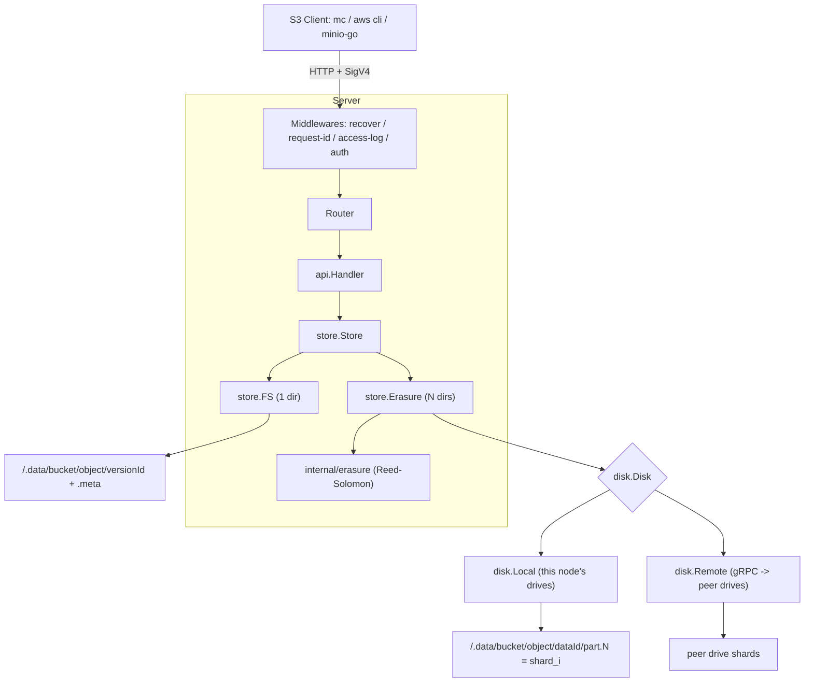
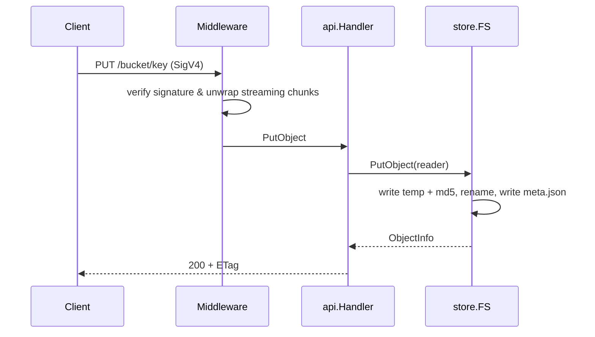

# gos3

A minimal, S3-compatible object storage server written in Go, built as a learning project.

> Goal: understand Go and object storage by rebuilding a small slice of MinIO.
> Scope: S3 API, SigV4, object versioning, Reed-Solomon erasure coding, gRPC distributed
> clusters, IAM authorization, lifecycle expiration, and OpenTelemetry tracing.

## Features

- Path-style S3 API: bucket CRUD, object PUT/GET/HEAD/DELETE, ListObjectsV2, batch DeleteObjects
- Object versioning: enable/suspend, version IDs, delete markers, ListObjectVersions
- Multipart upload: Initiate / UploadPart / ListParts / Complete / Abort / ListMultipartUploads
- Erasure coding across N drives (Reed-Solomon), write/read quorum, recovery from drive loss
- Distributed clusters: drives on peer nodes accessed over **gRPC + protobuf**; a whole node can
  fail and objects remain readable (reconstructed from parity shards on survivors)
- IAM: users, AWS-style JSON policies, per-request action/resource authorization
- Lifecycle: bucket lifecycle rules with Expiration (Days/Date) and a background scanner
- Observability: OpenTelemetry tracing (HTTP + gRPC + storage) and context-aware `slog`
  (`trace_id`/`span_id` on request logs)
- Embedded web console at `/ui` (single HTML+JS via `go:embed`): bucket/object browser and
  user/policy management
- AWS Signature V4: header signing, presigned URLs, streaming chunk signatures
- Versioned JSON metadata (`<root>/.meta/<bucket>/<object>.json` holds a list of versions),
  with per-version data under `<root>/.data/<bucket>/<object>/<dataId>/part.<n>` (one shard file per part per drive)
- Multipart staging under `<root>/.multipart/<bucket>/<uploadId>/` on every drive, with stale-upload cleanup
- Range requests and conditional requests via `http.ServeContent`
- Graceful shutdown, structured logging (`log/slog`), request IDs
- External dependencies: `klauspost/reedsolomon`, `google.golang.org/grpc`, `google.golang.org/protobuf`,
  `go.opentelemetry.io/otel` (+ `otelgrpc`)

## Build & Run

```sh
make build

# single-drive filesystem backend
./gos3 server /tmp/gos3-data

# erasure-coded backend across 4 drives (default layout: 2 data + 2 parity)
./gos3 server /data/d1 /data/d2 /data/d3 /data/d4

# override shard counts explicitly
./gos3 server -data-shards 3 -parity-shards 1 /data/d1 /data/d2 /data/d3 /data/d4

# distributed: 2 nodes x 2 drives each (run on each node, swapping -advertise/-peers)
./gos3 server -advertise node1:9001 -peers node2:9001 /data/d1 /data/d2
./gos3 server -advertise node2:9001 -peers node1:9001 /data/d1 /data/d2
```

Default credentials: `minioadmin` / `minioadmin`
(override with `-root-user` / `-root-password` or `GOS3_ROOT_USER` / `GOS3_ROOT_PASSWORD`).

## Verify with mc

```sh
mc alias set local http://127.0.0.1:9000 minioadmin minioadmin
mc mb local/demo
mc cp ./README.md local/demo/
mc ls local/demo/
mc cat local/demo/README.md
mc rm local/demo/README.md
mc rb local/demo
```

Health endpoints:

| Endpoint | Meaning |
| --- | --- |
| `GET /healthz`, `GET /minio/health/live` | process liveness (no disk/peer dependency) |
| `GET /minio/health/ready` | ready when online drives ≥ write quorum, otherwise 503 |
| `GET /minio/health/cluster` | 200 when online drives ≥ read quorum (503 otherwise); headers `X-Gos3-Online-Drives`/`Total-Drives`/`Read-Quorum`/`Write-Quorum`/`Pending-Heals` plus a JSON snapshot |

Drive health is probed every 15s (write/read/delete a 2 KiB probe file per drive; remote drives are
skipped while their node is known offline) and a drive that fails is reported as `disk-faulty`.
Missing shards discovered on the read path are queued and rebuilt in the background from the
remaining shards (`heal-rebuilt`).

## IAM (users, policies, authorization)

The root credential has full access. Additional users and AWS-style JSON policies are managed
through a small admin API guarded by HTTP Basic auth with the root credentials:

```sh
ADMIN=http://127.0.0.1:19000/gos3/admin
curl -u minioadmin:minioadmin -X PUT "$ADMIN/users?accessKey=alice&secretKey=alice123"
curl -u minioadmin:minioadmin -X PUT --data-binary @readonly.json "$ADMIN/policies?name=readonly"
curl -u minioadmin:minioadmin -X PUT "$ADMIN/attach?accessKey=alice&policy=readonly"
```

Each S3 request is mapped to an action (e.g. `s3:GetObject`) and resource
(`arn:aws:s3:::bucket/key`) and checked against the user's policies; explicit `Deny` wins,
default is deny. Endpoints: `users`, `policies`, `attach`, `detach` (`/gos3/admin/...`).

## Lifecycle

Lifecycle rules are managed through the standard S3 API (`GET/PUT/DELETE /bucket?lifecycle`),
e.g. with `mc ilm rule add --expire-days 30 myminio/bucket`. A background scanner
(`-scan-interval`, default `1m`) lists objects per bucket and deletes those matching an
enabled `Expiration` (by `Days` or `Date`).

## Observability

- Logs use `log/slog`; the HTTP access log and traced operations carry `trace_id`/`span_id`
  (via a context-aware `slog.Handler`).
- OpenTelemetry spans are created for HTTP requests (`HTTP <METHOD>`), gRPC disk RPCs
  (`/disk.DiskService/*`, server + client), and storage `erasure.PutObject`/`GetObject`.
- Exporter selection via environment:
  - `GOS3_OTEL_EXPORTER=stdout` — print spans as JSON (default in `docker-compose.yml`)
  - `GOS3_OTEL_EXPORTER=otlp` + `GOS3_OTEL_ENDPOINT=host:4317` — send to an OTLP collector
  - unset — tracing disabled

## Console (web UI)

A self-contained single-page console is embedded with `go:embed` and served at `/ui`
(open <http://127.0.0.1:19000/ui>). It signs in with the root credentials over HTTP Basic and
talks to the JSON admin API (`/gos3/admin/buckets`, `/users`, `/policies`), so the browser does
not need to implement SigV4. Features: bucket list/create/delete, object list (prefix/delimiter),
upload/download/delete, share (presigned GET URL, via `/gos3/admin/presign`), user add/remove,
policy save/attach.

It is plain HTML/CSS/JS with no build step and no Node toolchain; the file lives at
`internal/api/ui/index.html`.

## Verify with Docker

Builds a static server image and runs an end-to-end suite (`mc` + `curl`) against it.
The suite checks SigV4, bucket/object CRUD, listing, multipart upload integrity,
presigned URLs, anonymous denial, error cases, erasure recovery after simulated
drive loss, object versioning, IAM authorization, lifecycle expiration, and the embedded console
(35 checks).

```sh
make verify-docker
# or manually:
docker compose build
docker compose up -d --wait gos3      # host port 19000 -> container 9000
docker compose run --rm verify
docker compose down -v
```

The host port is `19000` by default to avoid clashing with a local MinIO on `9000`;
override with `GOS3_PORT=...`. The `verify` image bundles `mc` (copied from `minio/mc`).

Distributed cluster (2 nodes x 2 drives): writes across both nodes, then stops `node1`
and reads back through `node2` (reconstructing data from parity shards):

```sh
make verify-dist
```

## Architecture



The `Erasure` object layer is written only against the `disk.Disk` interface, so the
same code drives local directories and remote nodes. `internal/cluster` starts the gRPC
servers, discovers peers, and assembles the global ordered drive list (sorted by
node address), which every node computes identically. Internode traffic is split in three:
`disk.DiskService` (per-drive data plane, every request carries the expected `drive_uuid`),
`peer.PeerService` (node-level info/health, probed every 5s so a dead node is reported
as `peer-offline`), and `lock.LockService` (per-node namespace lock table). Object writes,
deletes and multipart completion take a quorum write lock on `bucket/object` before touching
data, so concurrent writers on different nodes serialize instead of overwriting each other.
`internal/format` then persists and verifies the layout on every drive
(`<drive>/.gos3.sys/format.json`): the first node by address initializes a fresh cluster,
the rest wait and verify, and each node cross-checks `deploymentID`/`layoutHash` with its
peers before serving requests.

Request pipeline:



## Package layout

| Package | Responsibility |
| --- | --- |
| `internal/cli` | Subcommand parsing, startup, graceful shutdown |
| `internal/config` | Runtime configuration and defaults |
| `internal/auth` | Credential store (access key -> secret key) |
| `internal/sign` | SigV4 verification and streaming chunk decoding |
| `internal/store` | Storage interface, filesystem (`FS`) and erasure (`Erasure`) backends, quorum reduction |
| `internal/erasure` | Reed-Solomon encode/decode (`klauspost/reedsolomon`) |
| `internal/disk` | `Disk` abstraction: `Local` (filesystem) and `Remote` (gRPC), plus generated proto |
| `internal/cluster` | gRPC servers, peer discovery, global drive assembly, peer layout cross-check |
| `internal/peer` | Node-level control plane: `PeerService` (info/health), peer connections and online state |
| `internal/lock` | Namespace lock: per-node lock table (`LockService`) plus a quorum-based `DRWMutex` |
| `internal/health` | Drive probes (15s), cluster health view for `/minio/health/*` |
| `internal/heal` | Minimal read-repair queue (rebuild missing shards from the remaining ones) |
| `internal/format` | `format.json` (deployment ID + per-drive UUIDs + drive layout) persistence and quorum validation |
| `internal/iam` | Users, policies, credentials provider, authorization evaluation |
| `internal/lifecycle` | Lifecycle configuration model and expiration evaluation |
| `internal/telemetry` | OpenTelemetry setup (stdout/OTLP) and context-aware slog handler |
| `internal/api` | S3 handlers, admin API, embedded console, XML responses, error model |
| `internal/server` | Router and middleware chain |
| `internal/version` | Version info injected via ldflags |

## Known limitations (M1–M5)

- `ListObjectVersions` pagination supports `key-marker` but not `version-id-marker`.
- No MFA-delete or version-level legal hold/retention.
- Erasure coding is currently **whole-object and in-memory** (no per-block streaming), so very large
  objects are bounded by RAM. This also bounds the gRPC shard message size (raised to 128 MiB);
  MinIO streams block-by-block, which is a future step.
- Drive layout and identity (deployment ID + per-drive UUIDs) are persisted in `<root>/.gos3.sys/format.json`
  and validated at startup, so a reordered or asymmetric cluster fails fast instead of corrupting shards.
  The data/parity shard counts are still derived from the drive count at startup (not persisted).
- Erasure writes are two-phase (stage shards under `.tmp/<dataID>` → `rename` to commit → commit metadata →
  drop the replaced version) with MinIO-style quorums: `read = dataShards`, `write = dataShards`
  (`+1` when `data == parity`). Unmet quorums surface as `503 SlowDown` and never destroy the previous
  version, but rollback leaves orphaned shard directories on drives that were unreachable mid-commit
  (no background sweep yet).
- Read repair only covers data shards discovered missing on the read path; object metadata missing on a
  lagging drive is tolerated by quorum reads but not actively rewritten, and there is no bitrot scan.
- Cluster membership is static (flags), with no leader election. Concurrent writes to the same key
  are serialized by a simplified dsync-style namespace lock (majority of *online* nodes, 10s acquire
  window, 10s refresh, 1m expiry), but a network partition can still let both sides write to their own
  majority if the cluster is split evenly. Peer liveness is probed (`peer-offline`/`peer-online`), and
  object PUT/GET/LIST/bucket ops require quorum instead of failing on the first unreachable drive.
- IAM state is stored per node and not replicated across the cluster; the admin API uses HTTP Basic
  over plaintext (use it on a trusted network or behind TLS).
- Lifecycle supports only `Expiration` (Days/Date); no transitions, noncurrent-version expiration,
  or tag/size filters.
- Multipart staging and part shards are spread across every drive (`.multipart/<bucket>/<uploadId>/`), each part is
  erasure-coded independently, and completion just renames the part shards into the object data directory
  (`.data/<bucket>/<object>/<dataId>/part.<n>`) before committing metadata — no re-encoding, no first-drive single point.
- Composite multipart ETag is `md5(concat(part md5s))-N`; part ETags are verified against the stored part metadata,
  but the assembled body is not re-hashed server-side.
- Minimum part size (5 MiB except the last) is not enforced yet.
- Streaming signature **trailer** variant (`...-TRAILER`) not supported.
- IAM, lifecycle, and event notification not implemented.
- Path-style addressing only (no virtual-host style).
