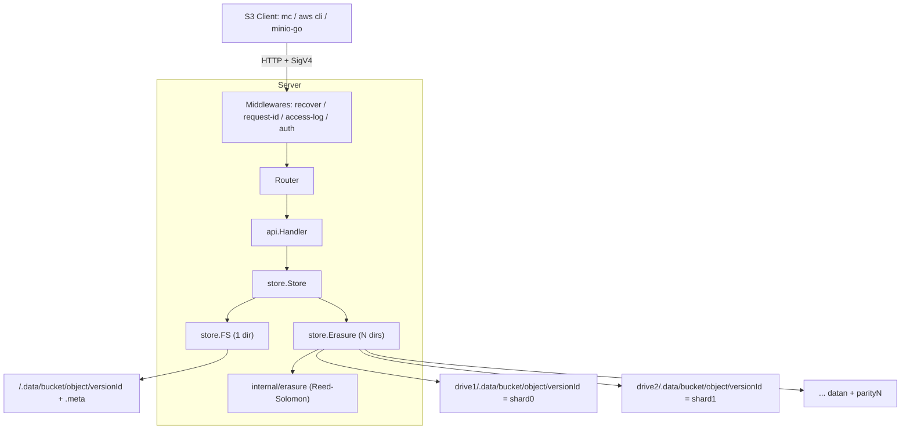

# gos3

A minimal, S3-compatible object storage server written in Go, built as a learning project.

> Goal: understand Go and object storage by rebuilding a small slice of MinIO.
> Scope (M1–M2): single-node filesystem backend, AWS SigV4 auth, basic S3 API.

## Features

- Path-style S3 API: bucket CRUD, object PUT/GET/HEAD/DELETE, ListObjectsV2, batch DeleteObjects
- Object versioning: enable/suspend, version IDs, delete markers, ListObjectVersions
- Multipart upload: Initiate / UploadPart / ListParts / Complete / Abort / ListMultipartUploads
- Erasure coding across N drives (Reed-Solomon), write/read quorum, recovery from drive loss
- AWS Signature V4: header signing, presigned URLs, streaming chunk signatures
- Versioned JSON metadata (`<root>/.meta/<bucket>/<object>.json` holds a list of versions),
  with per-version data under `<root>/.data/<bucket>/<object>/<versionId>`
- Multipart staging under `<root>/.multipart/<bucket>/<uploadId>/` with stale-upload cleanup
- Range requests and conditional requests via `http.ServeContent`
- Graceful shutdown, structured logging (`log/slog`), request IDs
- Only external dependency: `klauspost/reedsolomon`

## Build & Run

```sh
make build

# single-drive filesystem backend
./gos3 server /tmp/gos3-data

# erasure-coded backend across 4 drives (default layout: 2 data + 2 parity)
./gos3 server /data/d1 /data/d2 /data/d3 /data/d4

# override shard counts explicitly
./gos3 server -data-shards 3 -parity-shards 1 /data/d1 /data/d2 /data/d3 /data/d4
```

Default credentials: `minioadmin` / `minioadmin`
(override with `-root-user` / `-root-password` or `GOS3_ROOT_USER` / `GOS3_ROOT_PASSWORD`).

## Verify with mc

```sh
mc alias set local http://127.0.0.1:9000 minioadmin minioadmin
mc mb local/demo
mc cp ./README.md local/demo/
mc ls local/demo/
mc cat local/demo/README.md
mc rm local/demo/README.md
mc rb local/demo
```

Health endpoints: `GET /healthz`, `GET /minio/health/live`, `GET /minio/health/ready`.

## Verify with Docker

Builds a static server image and runs an end-to-end suite (`mc` + `curl`) against it.
The suite checks SigV4, bucket/object CRUD, listing, multipart upload integrity,
presigned URLs, anonymous denial, error cases, erasure recovery after simulated
drive loss, and object versioning (27 checks).

```sh
make verify-docker
# or manually:
docker compose build
docker compose up -d --wait gos3      # host port 19000 -> container 9000
docker compose run --rm verify
docker compose down -v
```

The host port is `19000` by default to avoid clashing with a local MinIO on `9000`;
override with `GOS3_PORT=...`. The `verify` image bundles `mc` (copied from `minio/mc`).

## Architecture



Request pipeline:

```mermaid
sequenceDiagram
    participant C as Client
    participant MW as Middleware
    participant H as api.Handler
    participant S as store.FS
    C->>MW: PUT /bucket/key (SigV4)
    MW->>MW: verify signature; unwrap streaming chunks
    MW->>H: PutObject
    H->>S: PutObject(reader)
    S->>S: write temp + md5, rename, write meta.json
    S-->>H: ObjectInfo
    H-->>C: 200 + ETag
```

## Package layout

| Package | Responsibility |
| --- | --- |
| `internal/cli` | Subcommand parsing, startup, graceful shutdown |
| `internal/config` | Runtime configuration and defaults |
| `internal/auth` | Credential store (access key -> secret key) |
| `internal/sign` | SigV4 verification and streaming chunk decoding |
| `internal/store` | Storage interface, filesystem (`FS`) and erasure (`Erasure`) backends |
| `internal/erasure` | Reed-Solomon encode/decode (`klauspost/reedsolomon`) |
| `internal/api` | S3 handlers, XML responses, error model |
| `internal/server` | Router and middleware chain |
| `internal/version` | Version info injected via ldflags |

## Known limitations (M1–M5)

- `ListObjectVersions` pagination supports `key-marker` but not `version-id-marker`.
- No MFA-delete or version-level legal hold/retention.
- Erasure coding is currently **whole-object and in-memory** (no per-block streaming), so very large
  objects are bounded by RAM. MinIO streams block-by-block; that is a future step.
- Erasure layout (drive count, data/parity) is fixed at startup and not persisted in a `format.json`,
  so data must be read back with the same layout.
- Multipart staging lives on the first drive only; the assembled object is erasure-coded on completion.
- Composite multipart ETag is `md5(concat(part md5s))-N`; no server-side checksum verification of the assembled body.
- Minimum part size (5 MiB except the last) is not enforced yet.
- Streaming signature **trailer** variant (`...-TRAILER`) not supported.
- Versioning, IAM, lifecycle, replication, erasure coding, distribution not implemented.
- Path-style addressing only (no virtual-host style).
