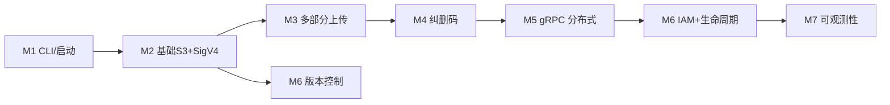
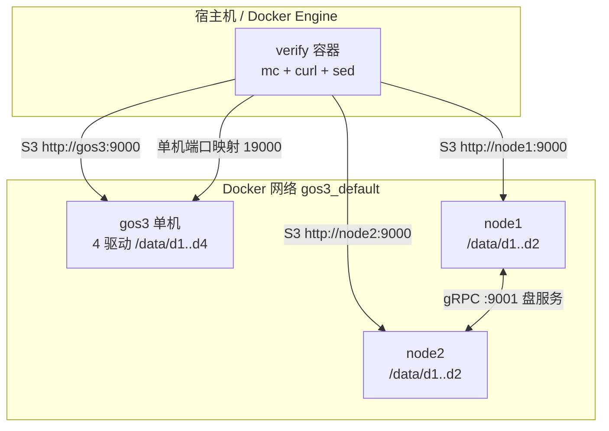
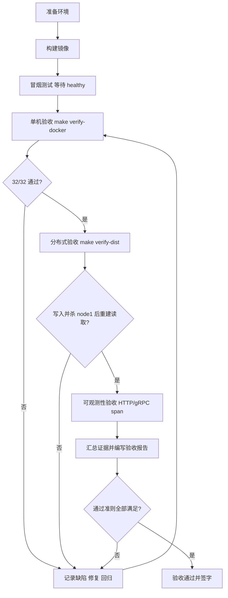
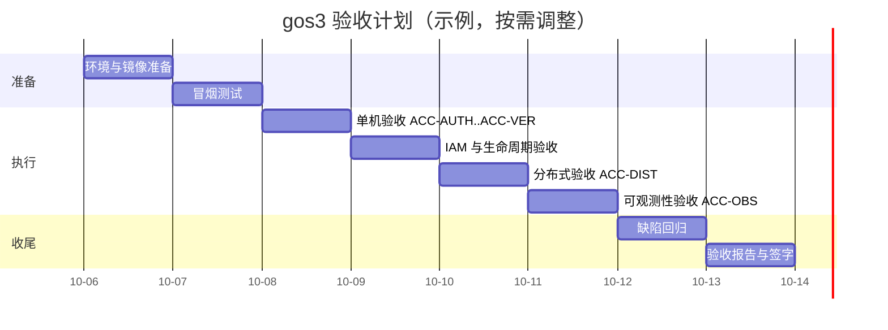

# gos3 验收项目计划（Acceptance Plan）

| 项目 | 内容 |
| --- | --- |
| 项目名称 | gos3 —— 学习型 S3 兼容对象存储 |
| 文档版本 | v1.0 |
| 编制日期 | 2026-10-05 |
| 验收对象 | `github.com/kxj/gos3`（M0–M7 全部里程碑） |
| 验收方式 | 自动化为主（Docker Compose + `mc` + `curl`）、人工抽查为辅 |
| 结论状态 | 待执行 |

---

## 1. 概述

本计划用于对 gos3 项目进行**阶段性验收**，确认已实现的功能在既定环境下可复现、可验证，并满足通过准则。

gos3 是参照 MinIO 复刻的学习项目，目标是打通"**S3 协议 → 鉴权 → 存储 → 一致性 → 分布式 → 权限 → 运维**"全链路。验收以可执行的端到端脚本为核心证据，避免"只看代码"。

## 2. 验收范围

### 2.1 纳入验收（In Scope）



- S3 基础 API、SigV4 验签、匿名拒绝、预签名 URL
- 多部分上传与合成完整性
- 纠删码分片、读写 quorum、单盘/多盘失效恢复
- gRPC 分布式、节点故障后重建读取
- 对象版本控制、删除标记、指定版本删除
- IAM 用户/策略/鉴权（只读允许、写入拒绝）
- 生命周期规则与后台过期删除
- OpenTelemetry trace（HTTP / gRPC span）与结构化日志
- 内嵌 Web 控制台（`/ui`）与 JSON 管理接口

### 2.2 不纳入验收（Out of Scope）

| 项 | 说明 |
| --- | --- |
| 性能/压测 | 本阶段不做基准与容量测试 |
| 安全渗透 | 明文 Basic Auth、无 TLS，仅用于学习环境 |
| 生产高可用 | 静态成员、无分布式锁/leader、无自动扩缩容 |
| 云厂商兼容矩阵 | 仅验证 `mc` 与 `aws-cli` 常用操作，不做全 API 覆盖 |
| 数据迁移/升级 | 无 `format.json` 版本迁移 |

## 3. 待验收功能与里程碑

| 里程碑 | 主题 | 关键验收点 |
| --- | --- | --- |
| M1 | 工程骨架 / CLI | `gos3 server` 启动、健康检查、优雅停机 |
| M2 | 基础 S3 + SigV4 | Bucket/Object CRUD、ListObjectsV2、签名与匿名拒绝 |
| M3 | 多部分上传 | Initiate/UploadPart/Complete、合成 ETag 与内容一致 |
| M4 | 纠删码 | 4 盘 2+2、丢 1/2 盘可读、低于 quorum 拒绝 |
| M5 | gRPC 分布式 | 2 节点 × 2 盘、杀节点后重建读取 |
| M6 | 版本控制 / IAM / 生命周期 | 多版本、删除标记、只读授权、到期删除 |
| M7 | 可观测性 | HTTP span、gRPC span、日志含 `trace_id`/`span_id` |

## 4. 验收环境

### 4.1 拓扑



### 4.2 环境要求

| 项 | 要求 |
| --- | --- |
| 操作系统 | Linux（WSL2 亦可），Docker Engine ≥ 24，Compose v2 |
| Go 工具链 | 宿主机可不安装；构建在 `golang:1.24-alpine` 容器内完成 |
| 镜像 | `golang:1.24-alpine`、`alpine:3.20`、`minio/mc:latest` |
| 端口 | 单机主机端口默认 `19000`（可用 `GOS3_PORT` 覆盖）；容器内 S3 `:9000`、gRPC `:9001` |
| 网络 | 构建期可访问模块代理（可回退 `goproxy.cn`） |
| 环境变量 | `GOS3_ROOT_USER/GOS3_ROOT_PASSWORD`（默认 `minioadmin`）、`GOS3_OTEL_EXPORTER=stdout` |

### 4.3 构建与镜像

| 服务 | 镜像 | 构建目标 |
| --- | --- | --- |
| gos3（单机/分布式节点） | `gos3:verify` | `Dockerfile#runtime`（静态二进制 + 非 root） |
| verify（验收执行器） | `gos3-verify:local` | `Dockerfile#verify`（mc + curl + coreutils） |

## 5. 验收流程



## 6. 通过准则（Exit Criteria）

验收**通过**需同时满足：

1. `docker compose build` 成功，无编译错误。
2. `make verify-docker` 输出 `== result: 35 passed, 0 failed ==`。
3. 单机验收中 `PASS otel: HTTP span exported` 成立。
4. `make verify-dist` 中写入阶段 5 项全部通过；`stop node1` 后经 node2 读取 md5 一致。
5. 分布式验收中 `PASS otel: gRPC span exported` 成立。
6. 所有用例无 P0/P1 未关闭缺陷；P2 缺陷有明确的"已知限制"记录（见第 9 节）。

## 7. 验收用例矩阵

> 自动断言均来自 `scripts/verify.sh` / `scripts/verify-cluster.sh`，可由 `make verify-docker` / `make verify-dist` 一键执行。

### 7.1 鉴权与协议（ACC-AUTH）

| 用例ID | 验收点 | 预期 | 自动断言 |
| --- | --- | --- | --- |
| ACC-AUTH-01 | SigV4 签名校验 | 通过并建立别名 | `alias set + signature accepted` |
| ACC-AUTH-02 | 匿名请求 | 拒绝（403） | `anonymous request denied` |
| ACC-AUTH-03 | 预签名 URL | GET 返回正确内容 | `presigned URL GET` |
| ACC-AUTH-04 | 健康检查匿名 | 200 | `health endpoint public` |

### 7.2 桶与对象（ACC-OBJ）

| 用例ID | 验收点 | 预期 | 自动断言 |
| --- | --- | --- | --- |
| ACC-OBJ-01 | 创建桶 | 成功 | `make bucket` |
| ACC-OBJ-02 | 上传小对象 | 成功 | `put small object` |
| ACC-OBJ-03 | 下载内容 | 与源一致 | `get small object content` |
| ACC-OBJ-04 | 对象元数据 | HEAD 成功 | `stat object` |
| ACC-OBJ-05 | 列表 | 含对象 | `list objects` |
| ACC-OBJ-06 | 批量删除 + 删空桶 | 成功 | `delete objects` / `remove empty bucket` |
| ACC-OBJ-07 | 非空桶删除 | 拒绝 | `non-empty bucket rejected` |

### 7.3 多部分上传（ACC-MP）

| 用例ID | 验收点 | 预期 | 自动断言 |
| --- | --- | --- | --- |
| ACC-MP-01 | 大对象上传 | 成功 | `put large object` |
| ACC-MP-02 | 触发分片 | 观测到 `?uploads` | `multipart initiate observed` |
| ACC-MP-03 | 合成完整性 | md5 与源一致 | `multipart content integrity` |

### 7.4 纠删码（ACC-ER）

| 用例ID | 验收点 | 预期 | 自动断言 |
| --- | --- | --- | --- |
| ACC-ER-01 | 4 盘 2+2 写入 | 成功 | `erasure seed object` |
| ACC-ER-02 | 丢 1 盘 | 仍可读（重建） | `erasure read after losing drive d2` |
| ACC-ER-03 | 丢 2 盘 | 仍可读（重建） | `erasure read after losing drives d2+d3` |
| ACC-ER-04 | 低于 quorum | 拒绝读取 | `erasure read with insufficient shards rejected` |

### 7.5 版本控制（ACC-VER）

| 用例ID | 验收点 | 预期 | 自动断言 |
| --- | --- | --- | --- |
| ACC-VER-01 | 启用版本控制 | 状态 Enabled | `versioning enable` / `versioning status enabled` |
| ACC-VER-02 | 多次覆盖 | 保留两个版本 | `two versions stored` |
| ACC-VER-03 | 最新版本读取 | 返回 v2 | `latest version content` |
| ACC-VER-04 | 删除生成删除标记 | 列表隐藏、版本保留 | `delete marker hides latest` / `versions retained after delete` |
| ACC-VER-05 | 永久删除指定版本 | 版本数减少 | `permanent delete of a version` |
| ACC-VER-06 | 暂停版本控制 | 成功 | `versioning suspend` |

### 7.6 分布式（ACC-DIST）

| 用例ID | 验收点 | 预期 | 自动断言 |
| --- | --- | --- | --- |
| ACC-DIST-01 | 两节点写入 | 分片跨节点、成功 | `put object across nodes` |
| ACC-DIST-02 | 分布式读取 | md5 一致 | `distributed read integrity` |
| ACC-DIST-03 | 杀掉 node1 | 经 node2 用校验分片重建可读 | `read after killing node1` |
| ACC-DIST-04 | 分布式列表 | 可见对象 | `list object` |

### 7.7 IAM（ACC-IAM）

| 用例ID | 验收点 | 预期 | 自动断言 |
| --- | --- | --- | --- |
| ACC-IAM-01 | 只读用户读取 | 允许 | `iam read allowed` |
| ACC-IAM-02 | 只读用户写入 | 拒绝 | `iam write denied` |

### 7.8 生命周期（ACC-LC）

| 用例ID | 验收点 | 预期 | 自动断言 |
| --- | --- | --- | --- |
| ACC-LC-01 | 添加规则（S3 API） | 200 | `lifecycle rule add` |
| ACC-LC-02 | 读取规则 | 返回 Enabled | `lifecycle rule listed` |
| ACC-LC-03 | 后台扫描过期 | 对象被删除 | `lifecycle expiration deletes object` |

### 7.9 控制台（ACC-UI）

| 用例ID | 验收点 | 预期 | 自动断言 |
| --- | --- | --- | --- |
| ACC-UI-01 | 访问 `/ui` | 返回 200 | `console UI served` |
| ACC-UI-02 | 页面内容 | 含 `gos3 console` | `console UI content` |
| ACC-UI-03 | 管理桶 JSON 接口 | 返回桶列表 | `console admin buckets API` |

### 7.10 可观测性（ACC-OBS）

| 用例ID | 验收点 | 预期 | 判定方式 |
| --- | --- | --- | --- |
| ACC-OBS-01 | HTTP trace span | 日志出现 `HTTP GET` span | `make verify-docker` 中的 otel 断言 |
| ACC-OBS-02 | gRPC trace span | 日志出现 `DiskService` span | `make verify-dist` 中的 otel 断言 |
| ACC-OBS-03 | 结构化日志 | 请求日志含 `trace_id`/`span_id`/`request-id` | 人工抽查 `docker compose logs gos3` |

## 8. 验收执行步骤

### 8.1 一键验收（推荐）

```sh
cd gos3
make verify-docker    # 单机：构建 → 启动 → 32 项断言 → otel HTTP span → 清理
make verify-dist      # 分布式：写入 → 杀 node1 → node2 重建读取 → otel gRPC span → 清理
```

### 8.2 人工验收（可选）

```sh
docker compose build
docker compose up -d --wait gos3
mc alias set local http://127.0.0.1:19000 minioadmin minioadmin
mc mb local/demo
mc cp ./README.md local/demo/
mc ls local/demo/
mc cat local/demo/README.md
docker compose down -v
```

### 8.3 证据采集

| 证据 | 采集方式 |
| --- | --- |
| 构建日志 | `docker compose build 2>&1 \| tee build.log` |
| 验收结果 | `make verify-docker 2>&1 \| tee verify-single.log` |
| 分布式结果 | `make verify-dist 2>&1 \| tee verify-dist.log` |
| 服务日志 | `docker compose logs gos3 > gos3.log` |
| 镜像指纹 | `docker images --digests gos3:verify gos3-verify:local` |

## 9. 风险与已知限制

| 编号 | 类型 | 描述 | 影响 | 处置 |
| --- | --- | --- | --- | --- |
| R-01 | 已知限制 | 纠删码为整对象内存编码，受 RAM 与 gRPC 128MiB 消息上限约束 | 超大对象不可用 | 记录并后续做流式分块 |
| R-02 | 已知限制 | 分布式为静态成员，无分布式锁/leader | 并发写同 key 不协调 | 记录，单写者假设 |
| R-03 | 已知限制 | IAM 每节点独立、管理 API 明文 Basic Auth | 集群 IAM 不一致/不安全 | 仅限学习环境 |
| R-04 | 已知限制 | 生命周期仅支持 Expiration（Days/Date） | 无 transition/非当前版本 | 记录 |
| R-05 | 环境风险 | 模块代理 / BuildKit 前端镜像偶发网络失败 | 构建失败 | 使用 `goproxy.cn` 回退；已移除 `# syntax` 依赖 |
| R-06 | 环境风险 | 主机 9000 端口可能被占用 | 启动冲突 | 使用 `GOS3_PORT=19000` |

## 10. 角色与职责

| 角色 | 职责 |
| --- | --- |
| 验收负责人 | 制定计划、执行一键验收、判定通过、签署报告 |
| 开发 | 修复验收缺陷、补充自动化断言、维护脚本 |
| 环境/运维 | 提供 Docker 环境、网络与端口、镜像拉取 |

## 11. 时间计划



## 12. 交付物清单

| 交付物 | 路径 |
| --- | --- |
| 源码 | `gos3/`（`main.go`, `internal/**`） |
| 构建定义 | `Dockerfile`, `Makefile` |
| 编排 | `docker-compose.yml`, `docker-compose.dist.yml` |
| 验收脚本 | `scripts/verify.sh`, `scripts/verify-cluster.sh` |
| 说明文档 | `README.md`, `todo.md`, `docs/acceptance-plan.md` |
| 原型依赖 | `go.mod`, `go.sum`, `internal/disk/disk.proto` 及生成代码 |

## 13. 附录

### 13.1 命令速查

| 目的 | 命令 |
| --- | --- |
| 单机一键验收 | `make verify-docker` |
| 分布式一键验收 | `make verify-dist` |
| 仅构建 | `docker compose build` |
| 启动单机 | `docker compose up -d --wait gos3` |
| 查看日志 | `docker compose logs -f gos3` |
| 清理 | `docker compose down -v` |
| 重新生成 proto | `make proto` |

### 13.2 术语

| 术语 | 说明 |
| --- | --- |
| dataShards / parityShards | 纠删码数据块 / 校验块数量 |
| write/read quorum | 达到才认定写成功 / 读可用 |
| delete marker | 版本化删除产生的删除标记 |
| Disk | 存储盘抽象（本地目录或远程 gRPC 节点） |
| span | 一次分布式追踪的操作单元 |

### 13.3 验收报告模板

```
项目：gos3
版本：<git describe>
日期：<YYYY-MM-DD>
环境：Docker <version> / Compose <version>
执行人：<name>

构建：PASS / FAIL
单机验收：35/35
分布式验收：write 5/5, read 2/2
控制台：/ui 200，管理桶接口可用
可观测性：HTTP span=PASS, gRPC span=PASS

未关闭缺陷：<列表或"无">
已知限制确认：R-01..R-06 已记录
结论：通过 / 不通过
签字：<name> <date>
```
