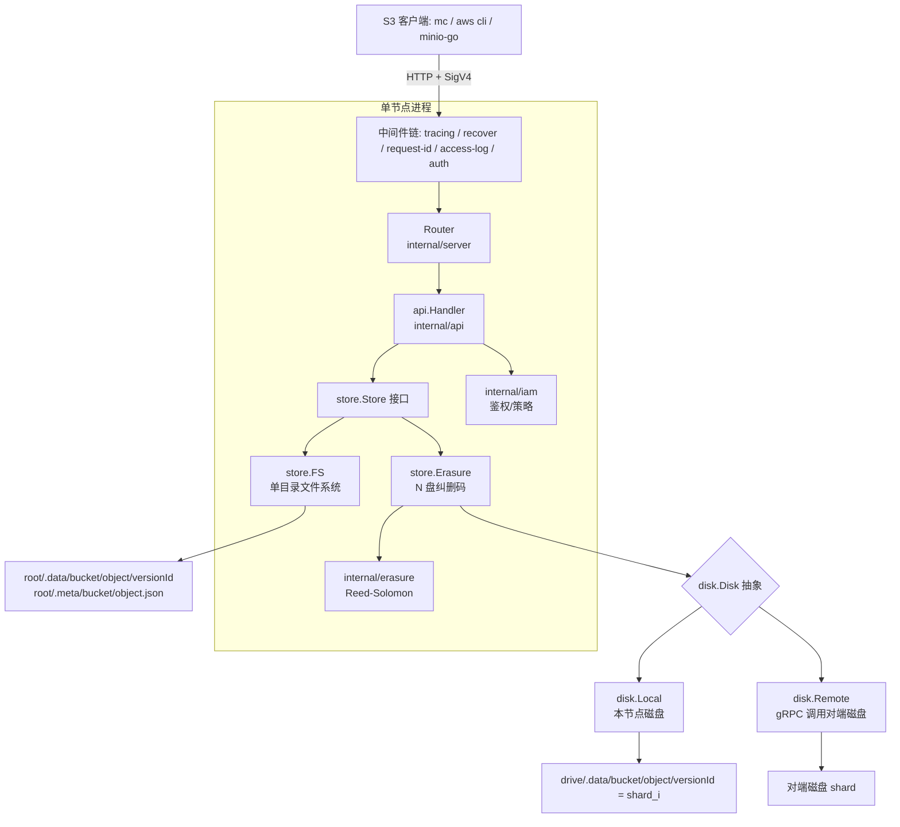
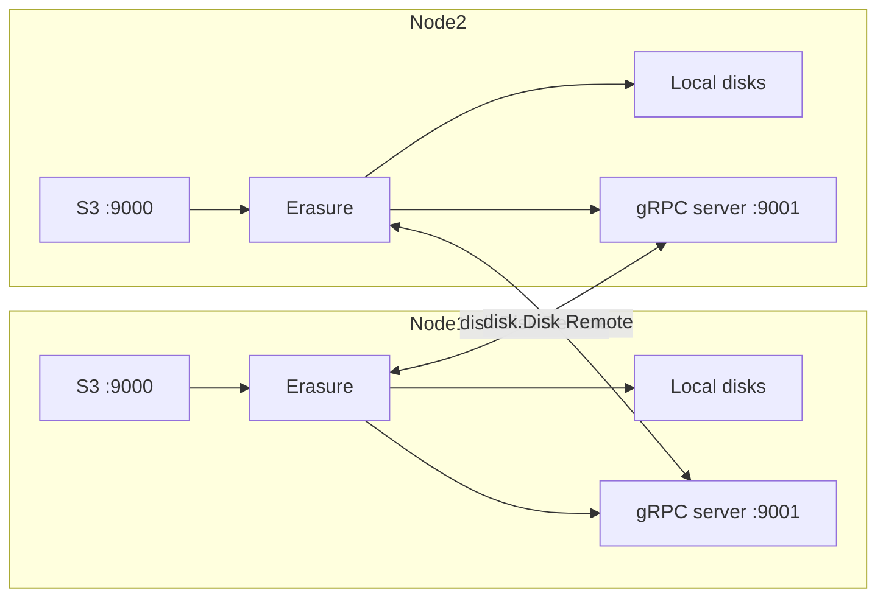
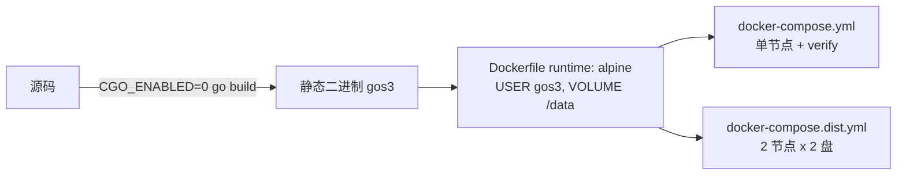

# gos3 项目架构总结

## 1. 项目定位

`gos3` 是一个用 Go 编写的最小化、S3 兼容对象存储服务，目标是学习 Go 与对象存储，
相当于"迷你版 MinIO"。覆盖能力：S3 API、SigV4 签名、对象版本化、
Reed-Solomon 纠删码、gRPC 分布式集群、IAM 鉴权、生命周期过期、OpenTelemetry 链路追踪。

- 模块名：`github.com/kxj/gos3`
- Go 版本：`1.24`（保持不动）
- 入口：`main.go` -> `internal/cli.Main`

## 2. 整体分层架构



核心设计：`store.Erasure` 只依赖 `disk.Disk` 接口，因此同一份纠删码逻辑
既能驱动本地目录，也能驱动远端节点磁盘。`internal/cluster` 启动 gRPC 磁盘服务、
发现对等节点，并按节点地址排序拼装出"全局有序磁盘列表"，保证每个节点计算出的顺序一致。

## 3. 请求处理链路

```mermaid
sequenceDiagram
    participant C as Client
    participant MW as Middleware
    participant H as api.Handler
    participant S as store.FS / store.Erasure
    C->>MW: PUT /bucket/key (SigV4)
    MW->>MW: tracing -> recover -> request-id -> access-log
    MW->>MW: 校验签名; 解包 streaming chunk
    MW->>H: PutObject
    H->>S: PutObject(reader)
    S->>S: 写临时文件 + md5 -> rename -> 写 meta.json
    S-->>H: ObjectInfo
    H-->>C: 200 + ETag
```

中间件顺序（`internal/server/middleware.go`，由内到外包裹）：

`tracing` -> `recoverer` -> `requestID` -> `accessLog` -> `auth` -> 业务路由

鉴权在 `auth` 中完成：校验 SigV4 签名后，将请求映射为
`action`（如 `s3:GetObject`）与 `resource`（`arn:aws:s3:::bucket/key`），
再交给 IAM 判定；显式 `Deny` 优先，默认拒绝。

## 4. 存储后端

| 后端 | 触发条件 | 说明 |
| --- | --- | --- |
| `store.FS` | 仅 1 个数据目录 | 单盘文件系统，元数据 JSON + 版本数据 |
| `store.Erasure` | ≥2 个目录或分布式 | Reed-Solomon 纠删码，写/读 quorum，可容忍盘/节点丢失 |

磁盘布局约定：

- 数据分片：`<drive>/.data/<bucket>/<object>/<versionId>`
- 版本元数据：`<root>/.meta/<bucket>/<object>.json`（保存版本列表）
- 分片上传暂存：`<root>/.multipart/<bucket>/<uploadId>/`
- 默认布局：总盘数一半做数据片，一半做校验片（`layout()` 自动推导）

## 5. 分布式集群



- 启动时需要 `-advertise` 声明自己的 gRPC 地址，`-peers` 声明对端。
- `cluster.Build` 带重试拨号对端，调用 `Info` 获取对端磁盘数，
  按节点地址排序合并为全局磁盘列表（每个节点结果一致）。
- 单个节点整机宕机后，存活节点可用校验片重建对象。
- gRPC 消息上限提升到 128 MiB。

## 6. 包职责一览

| 包 | 职责 |
| --- | --- |
| `internal/cli` | 子命令解析、启动流程、优雅关闭、生命周期/清理后台循环 |
| `internal/config` | 运行时配置与默认值 |
| `internal/auth` | 凭证存储（access key -> secret key） |
| `internal/sign` | SigV4 校验与 streaming chunk 解码 |
| `internal/store` | `Store` 接口、`FS` 与 `Erasure` 两种实现 |
| `internal/erasure` | Reed-Solomon 编解码（`klauspost/reedsolomon`） |
| `internal/disk` | `Disk` 抽象：`Local` / `Remote`，及生成的 proto |
| `internal/cluster` | gRPC 磁盘服务、对等发现、全局磁盘装配 |
| `internal/iam` | 用户、策略、凭证 Provider、鉴权判定 |
| `internal/lifecycle` | 生命周期配置模型与过期判定 |
| `internal/telemetry` | OpenTelemetry 初始化（stdout/OTLP）与 context-aware slog |
| `internal/api` | S3 处理器、Admin API、XML 响应、错误模型 |
| `internal/server` | 路由与中间件链 |
| `internal/version` | 版本信息（ldflags 注入） |

## 7. 构建与部署



- `Makefile`：`build` / `test` / `vet` / `verify-docker` / `verify-dist` / `proto`。
- 镜像使用多阶段构建，ldflags 注入 `Version/Commit/BuildTime`。
- 验证套件用 `mc` + `curl` 端到端校验（SigV4、CRUD、分片上传、预签名、
  纠删恢复、版本化、IAM、生命周期等 32 项）。
- 默认账号：`minioadmin / minioadmin`（可用环境变量覆盖）。
- 端口：S3 `9000`，节点间 gRPC `9001`。

## 8. 关键设计要点

1. **接口驱动**：`store.Store` 与 `disk.Disk` 两级抽象，本地/远端可互换。
2. **全局一致顺序**：节点地址排序保证各节点磁盘列表顺序一致，纠删码分片可对齐。
3. **版本化元数据**：以 JSON 列表保存对象所有版本，支持 delete marker。
4. **后台任务**：生命周期扫描（默认 1m）与过期分片上传清理（6h 周期，24h 阈值）。
5. **可观测性**：HTTP / gRPC / 存储三层 span，日志携带 `trace_id`/`span_id`。

## 9. 已知限制（M1–M5）

- 纠删码为**整对象、内存内**编解码，超大对象受内存限制，gRPC 分片消息上限 128 MiB。
- 纠删码布局（盘数、数据/校验片）启动时固定，未持久化到 `format.json`，读取需相同布局。
- 集群成员静态配置，无分布式锁/选主，跨节点并发写同 key 不协调。
- IAM 状态按节点存储，不跨集群复制；Admin API 为明文 Basic 认证。
- 生命周期仅支持 `Expiration`（Days/Date），无转换、非当前版本过期、标签/大小过滤。
- 分片上传暂存仅在第一个全局盘，完成后才对整体对象纠删编码。
- `ListObjectVersions` 分页支持 `key-marker`，但不支持 `version-id-marker`。
- 未强制最小分片大小（最后一片外 5 MiB）；不支持 streaming 签名 TRAILER 变体。
- 仅支持 path-style 寻址，无 virtual-host 风格。
