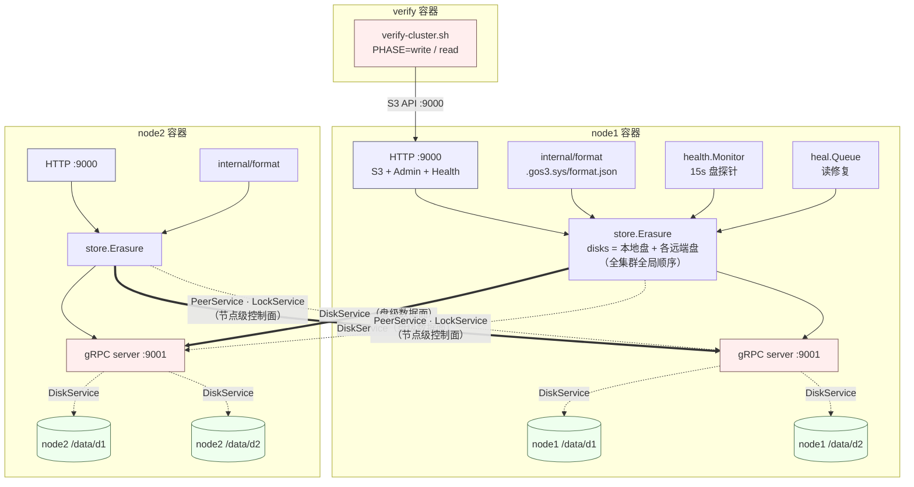
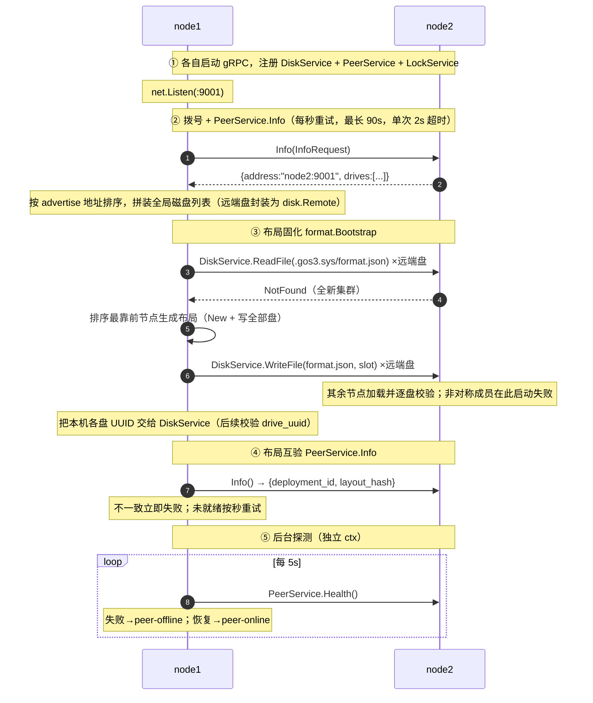

# gos3 分布式集群架构

本文描述 gos3 集群模式的**网络、存储与一致性架构**。以 `docker-compose.dist.yml` 的
2 节点（node1、node2）+ 验证容器（verify）为参照，逐层说明：

- 每个节点对外暴露哪些接口、内部由哪些组件构成；
- 节点之间通过哪三个 gRPC 服务通信、各自职责；
- 磁盘布局如何用 `format.json` 固化并保证各节点一致；
- 纠删码分片如何落到「全局有序磁盘列表」上；
- 读写法定人数（quorum）、健康探测与最小自愈如何工作。

> 通信「在什么时机发起、发了什么 RPC」的逐操作梳理见
> [`cluster-communication.md`](./cluster-communication.md)；
> 改造的分阶段设计与验收见 [`cluster-refactor-plan.md`](./cluster-refactor-plan.md)。

---

## 1. 架构总览

每个节点都是**对等**的：既处理 S3 请求，又把本地磁盘通过 gRPC 提供给其他节点读写。
没有主节点、没有选主，成员在启动时通过 `-advertise` / `-peers` 静态声明。



核心事实：

1. **S3 请求不转发**。客户端连哪个节点，就由哪个节点独立处理，对端只被当成「远端磁盘」。
2. **没有数据复制协议**。跨节点行为只有一种：本节点替客户端去**读写对端磁盘**。
3. **数据面与控制面分离**：磁盘级操作走 `DiskService`，节点级成员/健康/锁走
   `PeerService` / `LockService`，三者共用同一个 gRPC 端口（默认 `:9001`）。
4. **布局是唯一真相**：`format.json` 固化部署 ID、盘 UUID 与盘顺序，`store.Erasure`
   的盘列表由它推导，而不是靠运行期拼装。

---

## 2. 部署拓扑（docker-compose.dist.yml）

| 服务 | 命令要点 | 端口 | 数据卷 |
| --- | --- | --- | --- |
| `node1` | `-address :9000 -grpc-address :9001 -advertise node1:9001 -peers node2:9001 /data/d1 /data/d2` | 宿主 `19000`→`9000`，`19001`→`9001` | `node1-data` |
| `node2` | `-address :9000 -grpc-address :9001 -advertise node2:9001 -peers node1:9001 /data/d1 /data/d2` | 宿主 `19002`→`9000`，`19003`→`9001` | `node2-data` |
| `verify` | 运行 `scripts/verify-cluster.sh`，`S3_ENDPOINT=http://node1:9000` | — | — |

要点：

- `-advertise` 是本节点**对外广播**的 gRPC 地址，也是对端拨号使用的地址；`-peers`
  是要主动连接的其它节点。两节点互为 peer。
- `verify` 通过 `depends_on: condition: service_healthy` 等两节点 `/healthz` 就绪后，
  再执行写入/读回校验（`make verify-dist` 会先 `PHASE=write`，停掉 node1 后
  再 `PHASE=read` 经 node2 读回）。
- `GOS3_ROOT_USER`/`GOS3_ROOT_PASSWORD` 为 root 凭据（默认 `minioadmin`）；
  `GOS3_OTEL_EXPORTER=stdout` 把链路追踪输出到标准输出。
- 每节点 2 个目录、共 4 块盘；未显式指定分片参数时，`layout()` 推导为
  `data=2, parity=2`（见第 7 节）。

---

## 3. 单节点运行时组件

### 3.1 HTTP `:9000`（`internal/api` + `internal/server`）

承载 S3 API、Console/Admin API 与健康端点。与集群相关的健康端点：

| 端点 | 语义 | 判定 |
| --- | --- | --- |
| `GET /healthz`、`/minio/health/live` | 进程存活 | 恒 200，不依赖盘/peer |
| `GET /minio/health/ready` | 是否可提供**写**服务 | 在线盘数 ≥ 写法定人数，否则 503 |
| `GET /minio/health/cluster` | 是否可提供**读**服务 + 快照 | 在线盘数 ≥ 读法定人数则 200，否则 503 |

`/minio/health/cluster` 响应头带 `X-Gos3-Online-Drives` / `Total-Drives` /
`Read-Quorum` / `Write-Quorum` / `Pending-Heals`，响应体是 JSON 快照（各盘状态 +
各 peer 状态 + 待修复任务数）。

### 3.2 gRPC `:9001`（`internal/cluster` 组装）

同一个 `grpc.Server` 注册**三个**服务，单条消息上限 128 MiB，均挂 `otelgrpc`：

| 服务 | 包 | 作用域 | 方法 |
| --- | --- | --- | --- |
| `DiskService` | `internal/disk` | **磁盘级**数据面 | `ReadFile` `WriteFile` `Rename` `DeleteFile` `DeleteDir` `MakeDir` `Stat` `ListDir` `Walk` `Health` |
| `PeerService` | `internal/peer` | **节点级**控制面 | `Info`（地址/盘列表/部署 ID/布局摘要）、`Health`（存活） |
| `LockService` | `internal/lock` | **节点级**锁表 | `Lock` `Unlock` `RLock` `RUnlock` `Refresh` |

- 所有磁盘操作统一经 `disk.Disk` 接口；`disk.Local` 直接落本机目录，`disk.Remote`
  把每次调用转成一次 gRPC，并携带该槽位的**盘 UUID**（`drive_uuid`）供对端校验。
- `Rename` 是「临时写入 → 提交」两阶段写的提交动作（本地 `os.Rename` / 远程 `DiskService.Rename`）。

### 3.3 `store.Erasure`（`internal/store`）

纠删码对象层，只依赖 `disk.Disk` 接口，因此本地盘与远端盘对它完全透明。
每块盘的每一次读写，如果目标下标落在远端盘上，就自动变成一次 `DiskService` 调用。

### 3.4 布局文件 `format.json`（`internal/format`）

每块盘根目录下保存 `<drive>/.gos3.sys/format.json`：

```json
{
  "version": "1",
  "format": "xl",
  "id": "<deployment-id>",
  "xl": {
    "version": "3",
    "this": "<本盘 UUID>",
    "sets": [["<slot0 UUID>", "<slot1 UUID>", "..."]],
    "distributionAlgo": "SIPMOD"
  }
}
```

- `id`：部署 ID，所有节点、所有盘一致；
- `xl.this`：本盘在布局中的 UUID，用于校验「盘身份」；
- `xl.sets`：按「集合 → 槽位」排列的全部盘 UUID（当前单集合，`numSets=1`）；
  `LayoutHash()`（`sha256(sets)`）供跨节点快速比对；
- `FindDiskIndex` 由盘 UUID 反查槽位，用于诊断「盘顺序被改动」的启动失败。

### 3.5 健康探测与自愈（`internal/health` / `internal/heal`）

- `health.Monitor` 每 15s 对每块盘做「写 2 KiB 探针 → 读回校验 → 删除」；
  探针文件名带本节点 ID（`.gos3.sys/health-probe-<node>`），避免多节点共用路径互相
  rename/delete 造成「假坏盘」。远端盘在对端节点已知离线时直接判定不可用（跳过 RPC）。
- `heal.Queue` 消费读路径发现的缺失分片：用其余分片 `Decode → Encode` 重建并写回目标盘；
  目标盘离线时任务保持排队、不消耗重试次数（最多 5 次）。

---

## 4. 组建集群的启动时序

入口：`cli.runServer → buildStore → cluster.Build`（`internal/cli/cli.go:278`、`internal/cluster/cluster.go:58`）。



各步骤与源码对应：

1. **本地盘封装**：每个 `-data-dirs` 目录变成 `disk.Local`，ID 形如 `<advertise>/<序号>`。
2. **启动 gRPC**：`disk.NewServer` / `peer.NewServer` / `lock.NewServer` 注册到同一 server。
3. **拨号 + Info**：对每个 peer 调用 `Manager.Dial`，成功后记录其对外地址、盘数量。
4. **全局磁盘列表**：把 `{advertise: 本地盘数} ∪ {peer.Advertise: peer 盘数}` 按地址
   排序，顺序遍历分配全局槽位；本节点自己的盘插入其地址对应的位置。远端盘用
   `disk.NewRemote(id, conn, drive, uuid)` 封装，`uuid` 在布局固化后才可取值。
5. **`format.Bootstrap`**：读所有盘（含远端盘，经 `ReadFile`）的 `format.json`：
   - 全未格式化 → 由 `isFirstNode`（地址排序最靠前者）生成布局并写全部盘，未达多数派回滚；
   - 已有布局 → 取多数派作为参考，逐盘校验部署 ID / 布局摘要 / 盘 UUID，不一致返回
     `ErrInconsistent`（不可重试，直接启动失败）；未格式化的盘会被补齐。
6. **盘 UUID 下发**：把本机每块盘的 UUID 交给 `disk.Server`（此后对端请求里的
   `drive_uuid` 会被校验）。
7. **布局互验**：`verifyPeerLayouts` 向每个 peer 调 `PeerService.Info`，比对
   `deployment_id` 与 `layout_hash`；对端未就绪按秒重试，不一致立即失败。
8. **后台探测**：`Manager.ProbeLoop` 每 5s 调 `PeerService.Health`，维护在线状态。
9. **锁客户端集合**：本节点直调 + 各 peer 的 `LockService` 客户端（带 `Online()` 判断），
   交给上层组装 `lock.DRWMutex`。

注意：`Build` 是**串行**的，且整体受 `buildStore` 的 90s 超时约束——任一 peer 在 90s 内
`Info` 不通，本节点启动失败（运行期掉线已可容忍，启动期容错仍未实现）。

---

## 5. 全局磁盘顺序与盘身份

纠删码依赖「第 i 个分片写第 i 块盘」，因此**所有节点的磁盘列表顺序必须完全一致**。

- **顺序来源**：节点地址（`-advertise`）字典序 + 节点内盘下标。所有节点用同一规则计算，
  得到同一个全局槽位序列。例如 2 节点 × 2 盘：
  `[node1:9001/0, node1:9001/1, node2:9001/0, node2:9001/1]`。
- **盘身份**：`format.json` 为每个槽位固化一个 UUID。对端 `disk.Server` 收到请求后比对
  `drive_uuid`，不符返回 `FailedPrecondition`（对齐 MinIO 的 `errDiskStale`）——防止盘被
  替换或 `-data-dirs` 顺序变化后写错盘。
- **非对称成员**：如果某节点少配了一个 peer，其可见盘数不同，`format.Bootstrap` 会在
  「布局盘数 ≠ 集群盘数」时启动失败（`layout has N drives, cluster expects M`），
  而不是静默错配。

---

## 6. 磁盘上的存储布局

每块盘（本地目录或远端目录）下的相对路径：

| 路径 | 内容 |
| --- | --- |
| `.gos3.sys/format.json` | 布局文件（部署 ID + 本盘 UUID + 盘顺序） |
| `.gos3.sys/health-probe-<node>` | 健康探针文件（探测时临时存在） |
| `.meta/<bucket>/<object>.json` | 对象元数据（**版本列表**，全盘冗余） |
| `.meta/<bucket>/.bucket.json` | bucket 版本控制配置 |
| `.meta/<bucket>/.lifecycle.json` | bucket 生命周期规则 |
| `.data/<bucket>/<object>/<dataID>/part.<n>` | 对象数据分片：一个对象 = 若干 part，每盘每 part 一份分片 |
| `.data/<bucket>/<object>/<dataID>/.tmp/part.<n>` | 两阶段写的临时路径（rename 前） |
| `.multipart/<bucket>/<uploadID>/meta.json` | 分片上传元数据 |
| `.multipart/<bucket>/<uploadID>/part.<n>.<dataID>` | 该上传的分片数据（每盘一份分片） |
| `.multipart/<bucket>/<uploadID>/part.<n>.json` | 该 part 的元数据（号/大小/ETag/dataID） |

说明：

- **普通 PUT 也走 part 化布局**（单 part，`part.1`），与分片上传完成后的对象布局一致；
  历史对象（元数据无 `parts` 字段）仍按旧的单文件布局读取。
- 元数据（对象 meta / bucket 配置 / 上传 meta / part meta）都是**全盘冗余写入 + quorum 读取**。
- 新数据一律使用**独立的 `dataID`**，即使覆盖写 `null` 版本也不会与旧数据同路径，
  因此「写新 → 提交 → 删旧」中途没有覆盖窗口。

---

## 7. 法定人数（quorum）与一致性

分片数与法定人数（`internal/store/quorum.go`）：

- **分片数推导**（`layout()`）：未指定时 `parity = total/2`（至少 1），`data = total - parity`；
  2 节点 × 2 盘 = 4 盘 → `data=2, parity=2`。
- **读法定人数**：`read = dataShards`。
- **写法定人数**：`write = dataShards`；当 `data == parity` 时 `write = dataShards + 1`
  （即 2+2 布局的写法定人数为 3，避免只剩一半盘时仍能写入）。

一致性保证：

- **元数据 quorum 归约**：`readMetaQuorum` 并行读所有盘，按「最新版本签名（versionID +
  modTime + deleteMarker）」分组，只有达到读法定人数的签名才是权威值，候选里取最新
  modTime；单盘脏/落后元数据永远不会被采用。列举同理（`walkMetasQuorum` 逐 key 归约）。
- **两阶段写**：分片先写 `.tmp/...`，达到写法定人数后逐个 `Rename` 提交，再提交元数据；
  任一阶段不足则回滚，**旧版本数据与元数据始终可读**。
- **错误归约**：`reduceErrs` 取「多数盘共同报的错误」作为真实原因。
- **错误映射**：`ErrWriteQuorum` / `ErrReadQuorum` / `ErrLockTimeout` → `503 SlowDown`（可重试）。
- **命名空间锁**：写/删/完成分片上传前对 `bucket/object`（part 上传为
  `bucket/object/uploadID/partN`）申请分布式写锁，法定人数在**在线节点**上计算
  （多数派），把并发写同一 key 串行化。锁负责「不并发」，quorum 负责「够不够盘」。

---

## 8. 健康与自愈

- **盘健康**：`health.Monitor` 每 15s 探测每块盘，状态翻转打 `disk-faulty` / `disk-online`；
  远端盘在其节点离线时跳过探测。
- **集群健康视图**：`health.Cluster` 汇总在线盘数、读/写法定人数、peer 状态与待修复数，
  供 `/minio/health/ready`（写 quorum）与 `/minio/health/cluster`（读 quorum）判定。
- **最小自愈**：读路径发现某块盘缺分片 → 入队 `heal.Queue` → 后台用其余分片
  `Decode → Encode` 重建回写（`heal-rebuilt`）；目标盘离线时保持排队，重建失败最多重试
  5 次后放弃（`heal-give-up`）。不做 bitrot 扫描、MRF 持久化、rebalance。

---

## 9. 明确不做 / 边界

- 不实现 MinIO grid 的自研传输（WebSocket + msgp），继续用 gRPC。
- 不做多 pool / 多集合、加权放置、rebalance、decommission。
- 不做 SSE/KMS、跨站点复制、事件通知。
- **IAM 各节点独立**，不跨集群复制。
- 不做 bitrot 深度扫描与后台全量愈合。
- 分片数为整对象、内存内编解码，超大对象受内存与 gRPC 128 MiB 消息上限约束。

---

## 10. 源码锚点

| 主题 | 位置 |
| --- | --- |
| 集群组建、全局盘顺序、布局互验、后台探测 | `internal/cluster/cluster.go`（`Build`、`isFirstNode`、`verifyPeerLayouts`） |
| 启动/存储装配、后台任务、健康视图接线 | `internal/cli/cli.go`（`buildStore`、`layout`、`buildStore` 顶部注释） |
| 布局固化与校验 | `internal/format/format.go`（`Bootstrap`、`Load`、`Save`、`LayoutHash`、`FindDiskIndex`） |
| 节点控制面（成员/健康） | `internal/peer/server.go`、`internal/peer/manager.go`、`internal/peer/peer.proto` |
| 磁盘数据面 | `internal/disk/server.go`、`internal/disk/remote.go`、`internal/disk/disk.proto` |
| 分布式锁 | `internal/lock/server.go`、`internal/lock/client.go`、`internal/lock/lock.proto` |
| 纠删码与 quorum | `internal/store/erasure.go`、`internal/store/quorum.go`、`internal/store/store.go` |
| 健康探测与健康视图 | `internal/health/health.go`、`internal/api/handler.go` |
| 最小自愈 | `internal/heal/heal.go`、`store.Erasure.Rebuild` |
| 部署编排 | `docker-compose.dist.yml`、`Makefile`（`verify-dist`）、`scripts/verify-cluster.sh` |
