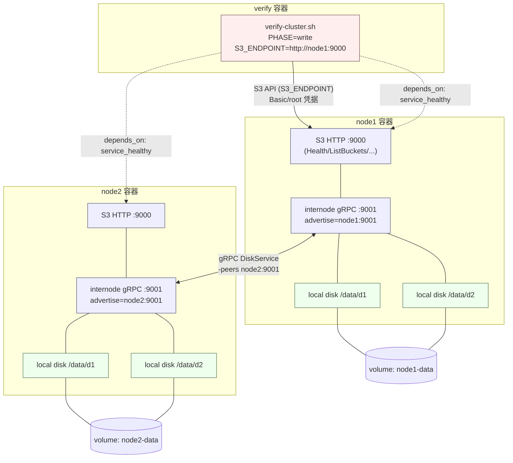

# gos3 分布式集群网络架构

本文档描述 `../docker-compose.yml` 中 2 节点 gos3 集群（node1、node2）加验证容器（verify）的网络与存储架构。

## 架构图

## 关键点

- **验证流量**：`verify` 容器通过 `S3_ENDPOINT=http://node1:9000` 访问 node1 的 S3 HTTP 接口。
- **集群内部通信**：node1 与 node2 的 `:9001` 之间通过 gRPC `DiskService` 互访，用于跨节点的磁盘读写（分片写入/读取、元数据）。
- **节点发现**：
  - `-advertise node1:9001` / `-advertise node2:9001`：本节点对外广播的 gRPC 地址，即对端拨号使用的地址。
  - `-peers node2:9001` / `-peers node1:9001`：要连接的对端 gRPC 地址，两节点互为 peer。
- **存储布局**：每节点 2 个本地目录，共 4 块盘；未指定分片参数时自动推导为 `data=2, parity=2`（见 `../internal/cli/cli.go` 的 `layout`）。
- **持久化**：`node1-data`、`node2-data` 两个命名卷分别挂载到各节点的 `/data`。
- **启动依赖**：`verify` 通过 `depends_on: condition: service_healthy` 等待两节点 `/healthz` 健康（S3 前先就绪）后再执行验证脚本。
- **环境变量**：`GOS3_ROOT_USER`/`GOS3_ROOT_PASSWORD` 为 root 凭据（默认 `minioadmin`）；`GOS3_OTEL_EXPORTER=stdout` 将链路追踪输出到标准输出。
