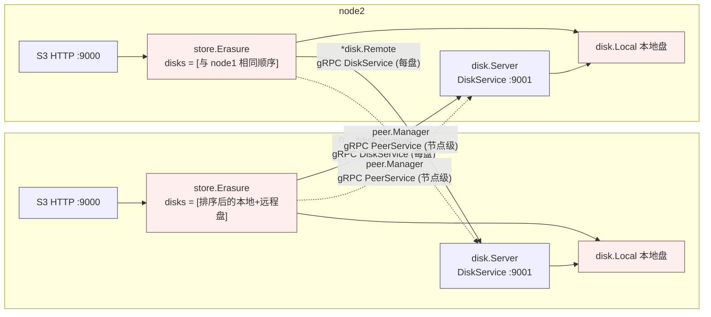
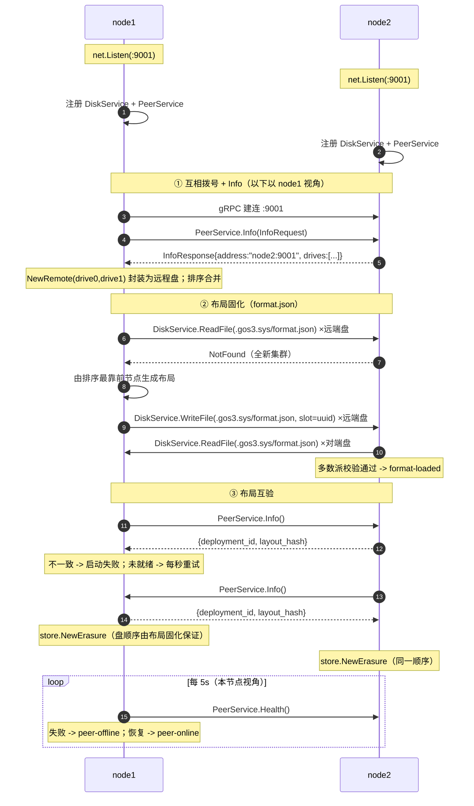
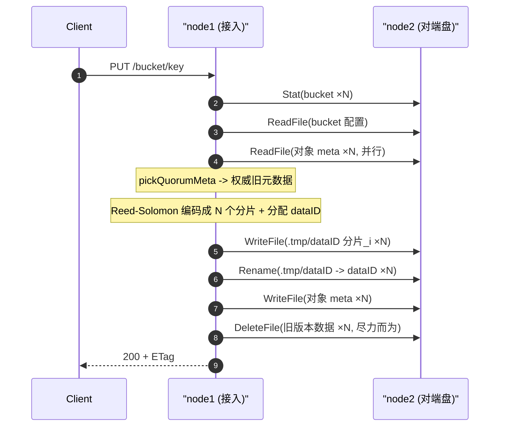
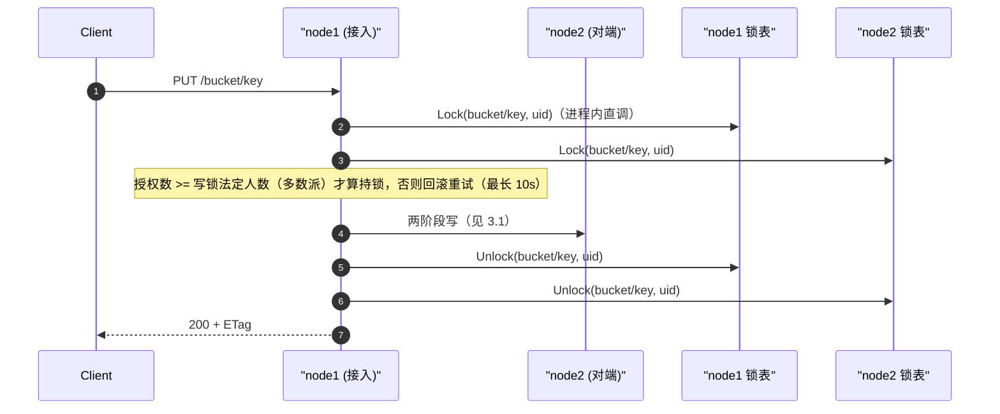
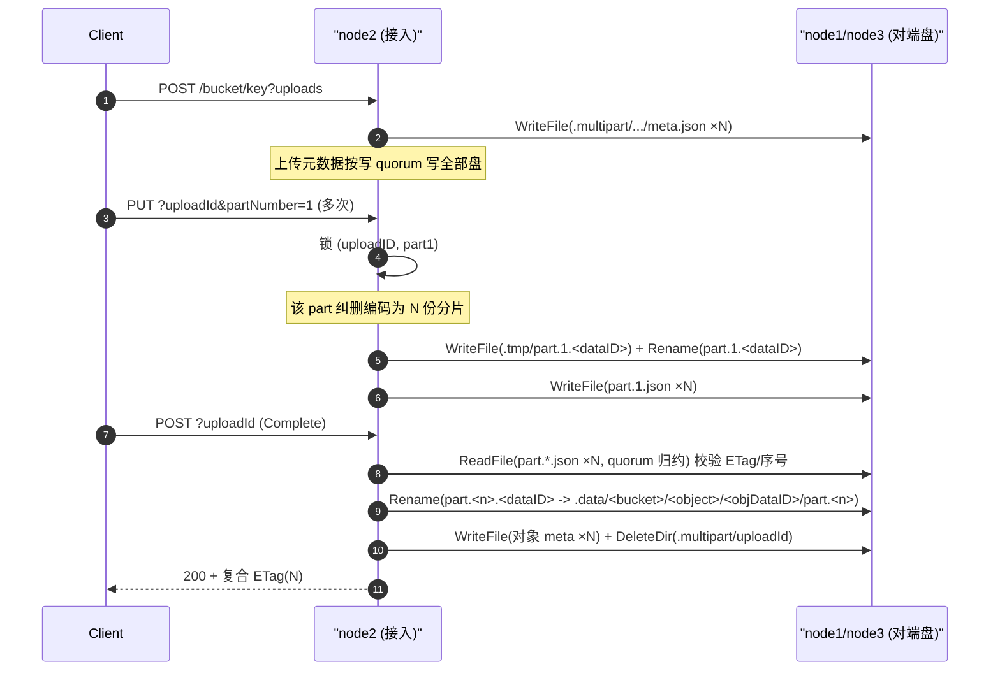
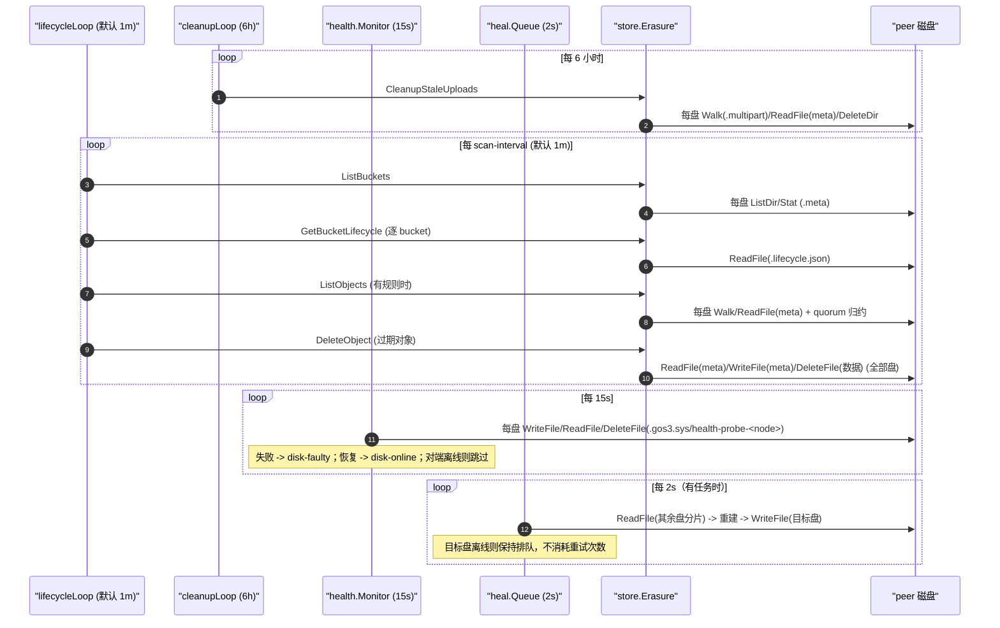
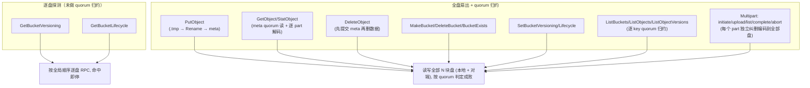

# gos3 集群节点间通信时机与操作梳理

本文只回答一个问题：**集群里的节点在什么时机、彼此发起了哪些通信、做了什么操作。**

核心结论先说：

1. 节点之间有**三条** gRPC 通道，跑在同一个 `-grpc-address`（默认 `:9001`）上：
   - `peer.PeerService`（节点级控制面）：成员信息 `Info`、存活探测 `Health`；
   - `lock.LockService`（节点级锁）：`Lock/Unlock/RLock/RUnlock/Refresh`，命名空间锁的节点侧锁表；
   - `disk.DiskService`（磁盘级数据面）：对某一块盘的读写删列与 `Rename`。
2. 数据面的发起方永远是 `*disk.Remote`（`internal/disk/remote.go`）；它把 `disk.Disk` 接口的每个方法转成一次 gRPC 调用，落到对端 `*disk.Server`（`internal/disk/server.go`），最终由对端 `*disk.Local` 落盘。
3. 节点之间**不转发 S3 请求、没有数据复制协议**。所有跨节点行为都只是「本节点替客户端，去读写对端磁盘」这一个动作。某个 bucket/object 的元数据由哪块盘保存、分片落在哪块盘，由全局磁盘顺序决定。
4. **健康检查分层**：`/healthz`、`/minio/health/live` 只看进程（不通信）；`/minio/health/ready` 看在线盘数是否 ≥ 写法定人数；`/minio/health/cluster` 返回完整快照（各盘/peer 状态 + 法定人数 + 待修复数）。盘的健康由本节点每 15s 的探针（写/读/删 2KB 文件）与 `peer.Manager` 的在线状态共同决定。
---

## 1. 通信总览

要点：

- `store.Erasure` 对 `disk.Disk` 的每一次读写，如果目标下标落在远程盘上，就会变成一次 gRPC 调用。它自身不感知本地/远程。
- 两个节点的 `e.disks` 顺序必须完全一致（按「节点地址 + 盘下标」全局排序，见 `cluster.go`），所以「第 i 个分片写第 i 块盘」在所有节点上指向同一块物理盘；每次请求还带上该槽位的盘 UUID，由对端 `disk.Server` 校验。
- 分片数据 `WriteFile/ReadFile`、对象元数据 `WriteFile/ReadFile`、bucket 目录 `Stat/MakeDir/DeleteDir/ListDir/Walk` 全部走数据面；节点级信息与存活探测走控制面。

---

## 2. 组建集群时的通信（启动阶段）

入口：`cli.runServer` → `buildStore` → `cluster.Build`（`internal/cli/cli.go:233`、`internal/cluster/cluster.go:53`）。

每个节点做六件事：

1. 启动自己的 gRPC server 并注册**三个**服务：`DiskService`（对本节点 `localDisks`）、`PeerService`（成员/健康）、`LockService`（节点锁表）。此时**只监听，不主动连任何人**。
2. 对 `-peers` 里的每个地址，交给 `peer.Manager.Dial`：建连 + 调用 `PeerService.Info` 探测，失败则每秒重试，最长 90 秒。
3. 收齐所有 peer 的 `Info`（返回 `address` + 盘列表 + 布局字段）后，把本地盘和 `NewRemote` 远程盘合并、按地址排序。
4. **布局固化**（`format.Bootstrap`）：读所有盘（本地 + 远程，经 `DiskService.ReadFile`）的 `<drive>/.gos3.sys/format.json`；
   全未格式化时由「地址排序最靠前的节点」生成布局并写回所有盘（未达多数派则回滚），其余节点等待并校验；
   已有布局时取多数派作为参考，逐盘比对部署 ID / 布局摘要 / 盘 UUID（不一致即启动失败）。
   随后把本机每块盘的 UUID 交给 `DiskService`（校验对端请求）与 `PeerService`（对外发布布局）。
5. **布局互验**：向每个 peer 调 `PeerService.Info`，比对 `deployment_id` 与 `layout_hash`；
   对端尚未就绪则每秒重试，不一致立即失败。
6. **启动探测**：`peer.Manager.ProbeLoop` 每 5s 调一次各 peer 的 `Health`，维护在线状态。

锁服务的客户端集合（本节点直调 + 各 peer 的 LockService 客户端）也在这里组装好交给上层；
每个远程锁客户端都带一个 Online() 判断，离线节点不参与锁的法定人数。

时机与操作：

| 时机 | 发起方 | RPC | 目的 | 备注 |
| --- | --- | --- | --- | --- |
| 每个节点启动 | 节点自身 | `net.Listen` + 注册 `DiskService`/`PeerService`/`LockService` | 让对端可访问本机磁盘、成员信息与锁表 | 被动等待 |
| 启动后 | 本节点 | gRPC 建连 + `PeerService.Info` | 发现对端地址、盘数量与布局字段 | 每秒重试，最长 90s；单次探测超时 2s |
| peer 全部就绪 | 本节点 | `DiskService.ReadFile`（`format.json`） | 读取/校验全局布局 | 逐盘读；读不到即视为未格式化 |
| 全新集群 | 排序最靠前节点 | `DiskService.WriteFile`（`format.json`） | 固化布局（部署 ID + 每盘 UUID） | 写全部盘；未达多数派回滚 |
| 布局就绪后 | 本节点 | `PeerService.Info`（带 `deployment_id`/`layout_hash`） | 与每个 peer 互验布局 | 不一致立即失败；对端未就绪按秒重试 |
| 运行期间 | 本节点 | `PeerService.Health`（每 5s，超时 2s） | 维护 peer 在线状态 | 状态翻转打 `peer-offline`/`peer-online` |
| 全部校验通过 | 本节点 | 无 | `store.NewErasure` 装配 | 盘顺序不再靠运行时拼装，而由布局确认 |

注意：`Build` 是**串行**的，任一 peer 在 90s 内 `Info` 不通，整个节点启动失败（`buildStore` 返回错误）；
布局固化阶段某个 peer 中途掉线时，本节点会按秒重试直到 90s 超时（离线盘的容错属于阶段 P1/P5 范围）。

---

## 3. 运行时的通信时机（客户端请求触发）

S3 请求只由**接入的那个节点**处理。该节点根据操作，对 `e.disks` 里属于对端的盘发起 gRPC。下面按 S3 操作列出会触发的 `DiskService` 方法。

设 `N` = 集群总盘数（本地 + 所有对端），`disks[0]` = 全局排序后的第一块盘。

### 3.1 写入对象 PUT（`store.Erasure.PutObject`）

写入是**两阶段**的：分片先写 `.tmp/<dataID>`，达到写法定人数后逐盘 `Rename` 提交，最后提交元数据。

触发（对每一块盘，除非注明「短路」）：

| 步骤 | 方法 | 盘范围 | 说明 |
| --- | --- | --- | --- |
| 1 | `Stat` | 全部盘 | `BucketExists`，需达到读法定人数；可见盘不足直接返回 `ErrReadQuorum` |
| 2 | `ReadFile`(bucket 配置) | 逐盘直到读到/不存在 | `GetBucketVersioning`（尚未做 quorum 归约） |
| 3 | `ReadFile`(对象 meta) | **全部盘（并行）** | `readMetaQuorum`：按最新版本签名达到读 quorum 的版本为权威 |
| 4 | `WriteFile`(`.tmp/<dataID>` 第 i 个分片) | 全部盘 | 暂存阶段；成功数须 ≥ 写 quorum，否则回滚临时文件 |
| 5 | `Rename`(`.tmp/<dataID>` → `<dataID>`) | 全部盘 | 提交阶段（同盘原子 rename）；成功数须 ≥ 写 quorum，否则删除已提交数据回滚 |
| 6 | `WriteFile`(对象 meta) | 全部盘 | `writeMetaAll`，成功数须 ≥ 写 quorum；失败则回滚数据 + 尽力回写旧 meta |
| 7 | `DeleteFile`(被覆盖的旧版本数据) | 全部盘 | 仅提交成功后执行；失败只留孤立文件 |

写法定人数：`writeQuorum = dataShards`，当 `dataShards == parityShards` 时为 `dataShards + 1`。
未达法定人数时返回 `503 SlowDown`（`write quorum not reached`），并保证**旧版本数据与元数据都还在**。

### 3.2 读取对象 GET/HEAD（`GetObject` / `StatObject`）

| 步骤 | 方法 | 盘范围 | 说明 |
| --- | --- | --- | --- |
| 1 | `ReadFile`(对象 meta) | **全部盘（并行）** | `readMetaQuorum`；`StatObject` 到此为止 |
| 2 | `ReadFile`(第 i 个分片，路径由 meta 的 `dataId` 决定) | 全部盘 | `readShards`，成功数 ≥ 读 quorum(=dataShards) 才能 `Decode`，否则 `503 read quorum not reached` |

`GetObject` **不做 `BucketExists` 检查**，直接读元数据。
读取不会返回「单盘上更新的可疑值」：只有达到读法定人数的元数据签名才会被采用。

### 3.3 删除对象 DELETE（`DeleteObject`）

统一遵循「先提交元数据、后删数据」：元数据提交未达写 quorum 时会尽力恢复旧元数据，客户端拿到 503。

| 场景 | 方法 | 盘范围 |
| --- | --- | --- |
| 指定 versionID | `ReadFile`(meta ×N 并行) → `WriteFile`/`DeleteFile`(meta ×N) → `DeleteFile`(该版本分片 ×N，尽力而为) | 全部盘 |
| 不指定 + 版本控制开启/暂停 | `Stat`(BucketExists) → `ReadFile`(bucket 配置) → `ReadFile`(meta ×N) → `WriteFile`(meta 加删除标记 ×N) | 全部盘 |
| 不指定 + 未开版本控制 | 同上，元数据中没有版本后 `DeleteFile`(meta ×N，需写 quorum) → 最后删分片数据 | 全部盘 |

### 3.4 列举（`ListBuckets` / `ListObjects` / `ListObjectVersions`）

列举不再「只读第一块盘」，而是**汇总所有盘再按 quorum 归约**：

| 操作 | 方法 | 盘范围 |
| --- | --- | --- |
| `ListBuckets` | 每盘 `ListDir(.meta)` + `Stat`，只保留在 ≥ 读 quorum 块盘上存在的 bucket | 全部盘 |
| `ListObjects` / `ListObjectVersions` | `Stat`(BucketExists) + 每盘 `Walk(.meta/bucket)` + 每盘 `ReadFile`(meta)，逐 key 按 quorum 归约 | 全部盘 |

可列举的盘数不足读法定人数时返回 `503`；只写到少数盘（未达 quorum）的对象不会出现在结果里，
因此各节点看到的列举结果一致。

### 3.5 bucket 元数据 / 版本控制 / 生命周期

| 操作 | 方法 | 盘范围 |
| --- | --- | --- |
| `MakeBucket` | `Stat` ×N + 对不存在的盘 `MakeDir`（新建数须 ≥ 写 quorum，否则 503） | 全部盘 |
| `DeleteBucket` | `Stat`(存在性，读 quorum) / `Walk`(非空检查，读 quorum) + 每盘 `DeleteDir`(meta/data/multipart) ×3 | 全部盘 |
| `GetBucketVersioning` | `Stat`(存在性) + `ReadFile`(配置，第一块可读盘) | 逐盘/单盘 |
| `SetBucketVersioning` | `Stat`(存在性) + `WriteFile`(配置) ×N（须 ≥ 写 quorum） | 全部盘 |
| `GetBucketLifecycle` | `Stat`(存在性) + `ReadFile`(.lifecycle.json) | 逐盘/单盘 |
| `SetBucketLifecycle` | `Stat`(存在性) + `WriteFile`(.lifecycle.json) ×N（须 ≥ 写 quorum） | 全部盘 |
| `DeleteBucketLifecycle` | `GetBucketLifecycle` + `DeleteFile` ×N | 全部盘 |

`BucketExists` 需要达到读法定人数才能判定「存在」；无法判定时返回 `503`（而不是谎报 `NoSuchBucket`）。

### 3.6 命名空间锁（写/删路径的额外 RPC）

对象写、删除、完成分片上传在动数据之前，会先对资源键 `bucket/object` 申请**写锁**：

| 时机 | 发起方 | RPC | 说明 |
| --- | --- | --- | --- |
| 写/删/完成分片上传前 | 本节点 | `LockService.Lock`（本地 + 所有在线 peer） | 并发写者在这里排队（重试间隔 50ms + 抖动，最长 10s） |
| 持锁期间 | 本节点 | `LockService.Refresh`（每 10s） | 续期；授权数低于法定人数时广播强释放 |
| 变更完成后 | 本节点 | `LockService.Unlock`（授权节点） | 释放；节点侧 1m 未续期也会自动过期 |
| 读锁（可选） | 本节点 | `LockService.RLock/RUnlock` | 已实现，当前读路径未使用 |

注意：锁的法定人数只在**在线节点**上计算（取自 `peer.Manager`），因此单节点掉线不会让写全部失败；
但数据面仍要满足写法定人数 —— 锁负责「不并发」，quorum 负责「够不够盘」。

### 3.7 分片上传（分布式，已去掉 `disks[0]` 单点）

分片上传的暂存目录 `.multipart/<bucket>/<uploadID>/` 存在于**所有盘**上，每个 part 独立纠删编码；
完成时只做 part 分片 `rename` 到对象数据目录（**不重新编码**）：

| 操作 | 方法 | 盘范围 |
| --- | --- | --- |
| `NewMultipartUpload` | `Stat`(存在性) + `ReadFile`(版本控制) + `WriteFile`(upload meta) | 全部盘（写 quorum） |
| `PutObjectPart` | `ReadFile`(upload meta, quorum) + `WriteFile`(临时分片) + `Rename`(提交分片) + `WriteFile`(part meta) | 全部盘（写 quorum；`(uploadID, partN)` 加锁） |
| `ListObjectParts` | `ReadFile`(upload meta, quorum) + 每盘 `ListDir` + `ReadFile`(part meta) | 全部盘（quorum 归约） |
| `CompleteMultipartUpload` | `ReadFile`(part meta ×N) + `Rename`(每个 part 的分片 ×N) + `WriteFile`(对象 meta ×N) + `DeleteDir` | 全部盘（整盘搬运成功的盘数须 ≥ 写 quorum） |
| `AbortMultipartUpload` | `ReadFile`(meta, quorum) + `DeleteDir` ×N | 全部盘（写 quorum） |
| `ListMultipartUploads` | 每盘 `ListDir` + `ReadFile`(meta) | 全部盘（quorum 归约） |
| `CleanupStaleUploads` | 每盘 `Walk(.multipart)` + `ReadFile`(meta) + `DeleteDir` ×N | 全部盘 |

对象数据布局：`.data/<bucket>/<object>/<dataID>/part.<n>`（每块盘上一份分片文件）；
普通 PUT 也走同一布局（单 part），历史对象仍按旧的单文件布局读取。
读取时逐个 part 解码再拼接，每个 part 都要满足读 quorum。

---

四个后台 goroutine 会**周期性**触发集群通信（`cli.go`）：生命周期扫描、过期上传清理、**盘健康探针**、**读修复 worker**。

| 任务 | 周期 | 触发的 RPC | 说明 |
| --- | --- | --- | --- |
| `cleanupLoop` | 6 小时 | `Walk`/`ReadFile`/`DeleteDir` | 对**所有盘**操作；`CleanupStaleUploads` 清 24h 以上的残留分片 |
| `health.Monitor` | 15s | 每盘 `WriteFile`/`ReadFile`/`DeleteFile`（探针） | 状态翻转打 `disk-faulty`/`disk-online`；对端离线时跳过该节点的盘 |
| `heal.Queue` | 2s（有任务时） | 其余盘 `ReadFile` + 目标盘 `WriteFile` | 读路径发现缺分片时入队；重建失败最多重试 5 次后放弃（`heal-give-up`） |
| `lifecycleLoop` | `-scan-interval`（默认 1m） | `ListDir`/`Stat`/`ReadFile`/`Walk`/`DeleteObject` 全套 | 只要存在带规则的 bucket，就会周期性地跨节点列对象（按 quorum 归约）、删过期对象（两阶段写） |

即：**即使没有客户端请求，集群也在按周期互发 gRPC**。

---

## 5. 不会触发通信的时机（澄清）

| 行为 | 是否触发节点间通信 |
| --- | --- |
| `GET /healthz`、`/minio/health/live` | 否，只看本进程存活 |
| `GET /minio/health/ready`、`/minio/health/cluster` | 否，读本地健康快照（盘探针与 peer 探测是后台周期任务，见第 4 节） |
| 盘健康探针（每 15s） | **是**：对每块盘（含远端）写/读/删 2KB 探针文件；对端节点已知离线时跳过 |
| `PeerService.Health` RPC | **是**：`peer.Manager.ProbeLoop` 每 5s 调用一次，维护在线状态 |
| `DiskService.Health` RPC | 否，当前无调用方（盘级 RPC，探针走的是数据面读写删） |
| `LockService.*` RPC | **是**：写/删/完成分片上传前后各一轮（Lock → … → Unlock），持锁超过 10s 还会每 10s `Refresh` |
| IAM 用户/策略管理（`/gos3/admin/*`） | 否，IAM 状态各节点独立，不复制（`README.md` 已注明） |
| S3 请求转发 | 不存在；客户端连哪个节点就由哪个节点处理，对端只被当作「磁盘」 |
| 优雅退出 `cluster.Close` | 关闭到 peer 的 client conn + `grpcServer.Stop()`，不发送业务 RPC |

---

## 6. 关键性质与注意点

- **扇出宽度固定为 N**：只要操作涉及「全部盘」（写对象、写 meta、写 bucket 配置、删版本、列举），就一定会在**每个节点**上产生 gRPC 往返，代价随盘数线性增长。
- **无 `disks[0]` 单点**：对象读写、列举、分片上传都已改为「全盘扇出 + quorum 归约/提交」；数据布局为 `.data/<bucket>/<object>/<dataID>/part.<n>`，每个 part 独立纠删编码。
- **元数据按 quorum 归约**：meta 由 `writeMetaAll` 写所有盘（需写 quorum），读取时 `readMetaQuorum` 并行读所有盘并按「最新版本签名达到读 quorum」选权威值，单盘脏/落后元数据不会被采用。
- **两阶段写 + 法定人数**：分片先写 `.tmp/part.<n>`，达写 quorum 后 `Rename` 提交，再提交 meta；任一阶段不足则回滚，旧版本始终可读。`writeQuorum = data(+1 if data==parity)`，`readQuorum = data`。
- **命名空间锁串行化写**：写/删/完成分片上传前对 `bucket/object` 申请分布式写锁（多数派；10s 抢锁窗口 + 10s 续期 + 1m 过期），并发写同一 key 不会互相覆盖元数据；读路径不加锁，靠 quorum 归约 + 两阶段写保证读到完整版本。
- **链路追踪**：gRPC client/server 都挂了 `otelgrpc` handler，跨节点调用会生成 `/disk.DiskService/*`、`/peer.PeerService/*` 与 `/lock.LockService/*` span。
- **启动强依赖 peer**：`Build` 串行拨号且重试 90s，peer 未就绪会导致本节点启动失败（运行期掉线已可容忍，启动期容错仍未实现）。
- **盘身份校验**：数据面请求带 `drive_uuid`，对端比对本盘 UUID，不符返回 `FailedPrecondition`（防止盘被替换/顺序变化后写错盘）。
- **掉线可感知 + 法定人数语义**：`peer.Manager` 每 5s 探测一次；盘数不足时读返回 `503 read quorum not reached`、写返回 `503 write quorum not reached`，都不会给出可疑结果。
- **健康反映 quorum**：`/minio/health/cluster` 以读法定人数判定 200/503，`/minio/health/ready` 以写法定人数判定；盘级探针 15s 一轮，坏盘打 `disk-faulty`。
- **最小自愈**：读路径发现缺分片 → `heal.Queue` 入队 → 后台用其余分片 RS 重建回写（`heal-rebuilt`）；不做 bitrot 扫描/rebalance。

---

## 7. 一图速查：S3 操作 → 跨节点 RPC

> 说明：所有磁盘访问统一经 `disk.Disk` 接口，跨节点与本地无法从 `store.Erasure` 侧区分；上表「单盘/逐盘/全盘」描述的是**访问的盘数量**，只要该盘在别的节点上，就对应一次 gRPC `DiskService` 调用。

---

### 相关源码锚点

- 组网与拨号：`internal/cluster/cluster.go`（`Build`、`verifyPeerLayouts`）、`internal/peer/manager.go`（`Dial`/`Probe`/`ProbeLoop`）
- 布局固化：`internal/format/format.go`（`Bootstrap`/`Load`/`Save`/`FindDiskIndex`，路径 `<drive>/.gos3.sys/format.json`）
- 控制面服务端：`internal/peer/server.go`（`Info` 返回 `address`/`drives`/`deployment_id`/`layout_hash`；`Health` 节点存活）
- 数据面服务端：`internal/disk/server.go`（盘级 `ReadFile/WriteFile/...`，含 `drive_uuid` 校验）
- gRPC 客户端（远程盘）：`internal/disk/remote.go`
- RPC 定义：`internal/disk/disk.proto`（数据面）、`internal/peer/peer.proto`（控制面）、`internal/lock/lock.proto`（锁服务）
- 命名空间锁：`internal/lock/server.go`（节点锁表 + LockService）、`internal/lock/client.go`（DRWMutex/quorum/续期）
- 健康与自愈：`internal/health/health.go`（盘探针 + 集群健康视图）、`internal/heal/heal.go`（修复队列）、`store.Erasure.Rebuild`（分片重建）
- 扇出逻辑：`internal/store/erasure.go`（`putBytes` 两阶段写、`readShards`、`writeMetaAll`、`.multipart` 系列）
- 法定人数与归约：`internal/store/quorum.go`（`readQuorum`/`writeQuorum`/`reduceErrs`/`pickQuorumMeta`/`readMetaQuorum`/`walkMetasQuorum`）
- 后台任务：`internal/cli/cli.go`（`lifecycleLoop`、`cleanupLoop`）
