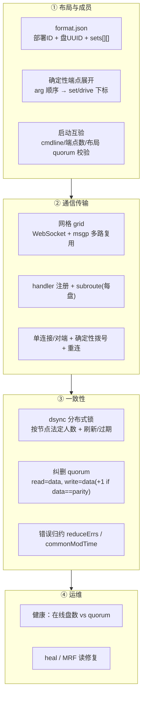
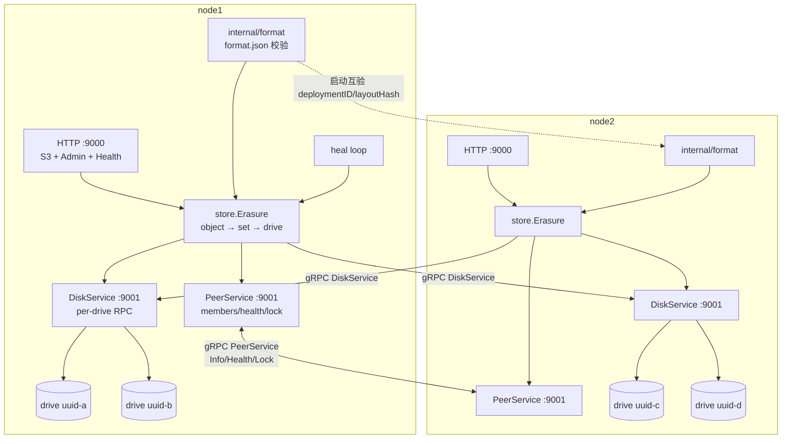
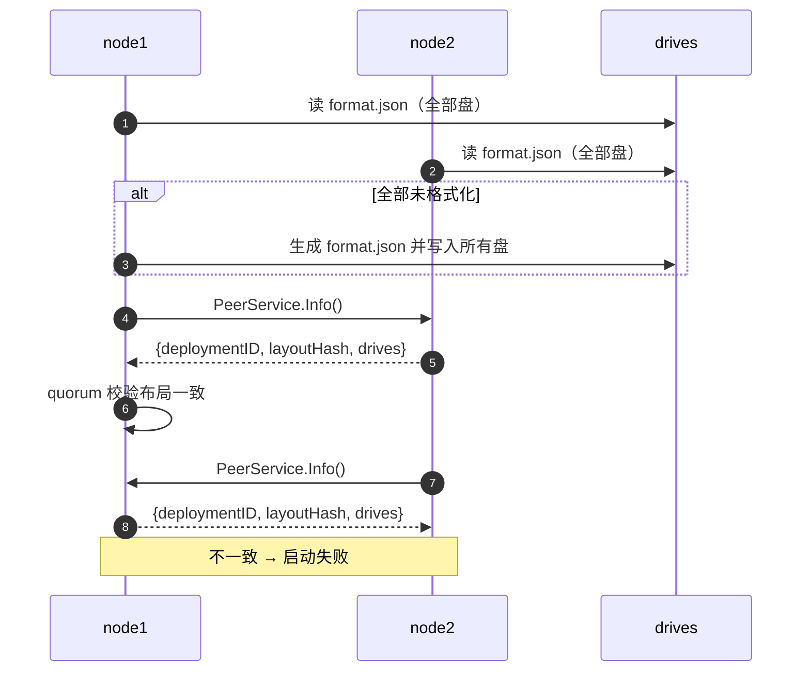
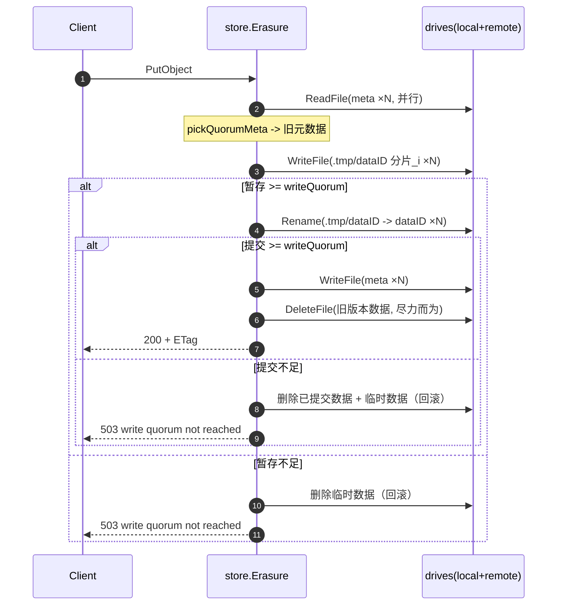
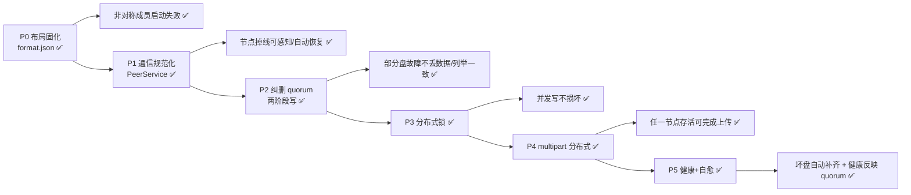

# gos3 集群通信改造计划（对标 MinIO）

> 目标：以 MinIO 的集群通信与布局方案为参照，对 gos3 做一次**聚焦通信与一致性**的改造。
> 约束：gos3 是学习项目，**只要求覆盖当前已实现的特性并做到完备**，不追求 MinIO 的规模与全部能力。
> 前置阅读：`docs/cluster-communication.md`（现状通信时机梳理）。

---

## 施工进度

| 阶段 | 状态 | 落地内容 | 验收证据 |
| --- | --- | --- | --- |
| P0 布局固化 | ✅ 已完成 | `internal/format`（`format.json` + 部署ID + 盘UUID + 多数派校验 + 初始化回滚）、`cluster.Build` 装载布局并与 peers 互验 `deployment_id`/`layout_hash`、单机多盘同样固化 | 见下方「P0 验收记录」 |
| P1 通信规范化 | ✅ 已完成（通信层） | `internal/peer`：`PeerService`（Info/Health）+ `PeerManager`（单连接/在线状态/5s 探测）；`DiskService` 剥离节点级接口、改盘级 `Health`、请求带 `drive_uuid` 校验；`peer-offline`/`peer-online` 日志 | 见下方「P1 验收记录」 |
| P2 纠删 quorum | ✅ 已完成 | 读写法定人数公式（`data(+1 if data==parity)`）、`readMetaQuorum` 归约、两阶段写（临时→rename→提交 meta，失败回滚）、列举按 quorum 归约、`disk.Rename`、bucket 级操作按 quorum、quorum 错误映射 503 | 见下方「P2 验收记录」 |
| P3 分布式锁 | ✅ 已完成 | `internal/lock`：节点侧锁表（1m 过期）+ `LockService`（Lock/Unlock/RLock/RUnlock/Refresh）+ `DRWMutex`（quorum、10s 续期、丢 quorum 广播强释放、抢锁等待 10s）；`store` 的 PutObject/DeleteObject/CompleteMultipartUpload 加写锁；单机模式退化为进程内互斥 | 见下方「P3 验收记录」 |
| P4 multipart 分布式 | ✅ 已完成 | 上传元数据/part 元数据按 quorum 写全部盘、每个 part 独立纠删编码到全部盘、`ListObjectParts` quorum 归约、完成时只做 part 文件 rename + 提交 meta（不重新编码）、abort/清理对所有盘生效、`(uploadID, partN)` 粒度锁 | 见下方「P4 验收记录」 |
| P5 健康 + 自愈 | ✅ 已完成 | `internal/health`（15s 盘探针 + 集群健康视图）、`/minio/health/live|ready|cluster`、`internal/heal`（读路径发现缺分片 → 后台重建回写） | 见下方「P5 验收记录」 |

### P0 验收记录

命令（本机双节点，`/tmp/g3c` 为数据目录）：

```bash
gos3 server -address :9000 -grpc-address :9001 -advertise 127.0.0.1:9001 -peers 127.0.0.1:9011 d1 d2
gos3 server -address :9010 -grpc-address :9011 -advertise 127.0.0.1:9011 -peers 127.0.0.1:9001 e1 e2
```

| 验收项 | 结果 |
| --- | --- |
| 两节点启动成功，日志打印同一 `deployment`/`layout`/`order` | ✅ 两节点均为 `deployment=2a289804-…`、`layout=91fb81f9…`、`order=[127.0.0.1:9001 127.0.0.1:9011]` |
| 布局互验 | ✅ 先就绪方打印 `waiting-for-peer-layout`，对端就绪后打印 `peer-layout-ok` |
| 4 块盘的 `format.json` | ✅ 同一部署 ID/布局，`xl.this` 分别等于本盘槽位 UUID |
| 跨节点读写 | ✅ 在 node1 写入、node2 读取（PUT/GET/LIST 全通过） |
| 重启复用布局 | ✅ 两节点打印 `format-loaded`，旧对象仍可读 |
| 非对称成员启动失败 | ✅ 三节点中让 node2 少配一个 peer：node2 报 `inconsistent disk layout: layout has 6 drives, cluster expects 4` 并退出 |
| 盘顺序改动启动失败 | ✅ 交换 `-data-dirs` 顺序：报 `drive 127.0.0.1:9001/0 holds uuid … (slot 1), but is used at slot 0` 并退出 |
| 单元测试 | ✅ `internal/format`（初始化/回滚/等待/补齐/非对称/乱序） |

### 已识别、留给后续的问题（P0–P5 完成后仍存在）

1. **启动期 peer 掉线**：布局固化/互验阶段某块盘不可达时会按秒重试到 90s 超时，错误信息埋在 `waiting-for-*` 里；
   运行期已按 quorum + 盘健康容忍掉线，但「启动期就少一个节点」仍会失败（需要 format 读取按 quorum 判定）。
2. **`format.json` 只落部署级布局**：`data/parity` 分片数仍按启动时的盘数推导，未写入布局。
3. **bucket 配置读取未做 quorum 归约**：`GetBucketVersioning`/`GetBucketLifecycle` 仍取「第一块可读盘」，
   写路径已按写法定人数提交。
4. **孤立分片/临时文件**：两阶段写失败回滚后若某块盘不可达、或覆盖写提交成功但旧版本数据所在盘当时不可达，
   会留下 `.data/<bucket>/<object>/.tmp/...` 或旧 `dataID` 目录（P4 的 E2E 中实测到这种残留）；
   目前只做了「读时缺分片 → 重建」，还没有后台清扫任务（列入阶段 6）。
5. **自愈只覆盖数据分片**：对象 meta 缺失靠 quorum 读容忍，没有主动补写回落后盘。

### P2 验收记录

| 验收项 | 结果 |
| --- | --- |
| 法定人数公式 | ✅ 单测：`2+2 → read=2/write=3`，`3+2 → read=3/write=3` |
| 未达写 quorum 的覆盖写 | ✅ 4 盘（2+2）集群杀掉 node2 后 PUT 返回 `503 SlowDown: Write quorum not reached...`，随后 GET 仍返回旧内容 `version-1`（旧数据未被破坏） |
| 达写 quorum 的写入 | ✅ 6 盘（4+2）集群杀掉 node3（剩 4 盘 = 写 quorum 4）后 PUT/GET 均 200 |
| 读 quorum 不足 | ✅ 4 盘集群只剩 2 盘且 6 盘集群只剩 2 盘时 GET 返回 `503 SlowDown: Read quorum not reached`（不返回可疑数据） |
| bucket 判定 | ✅ 可见盘不足或只有少数盘上有 bucket 时返回 `503`（不再谎报 `NoSuchBucket`） |
| 部分盘元数据落后 | ✅ 单测：人为只写 1 块盘的「更新版」元数据后，GET/LIST 仍返回已提交版本；只写 1 块盘的对象不出现在 LIST 中 |
| rename 提交失败回滚 | ✅ 单测：注入 rename 失败后旧版本可读，盘上无残留临时分片 |
| 删除语义 | ✅ 先提交元数据再删数据；单测验证删除后 GET 为 404、LIST 为空 |
| 旧数据兼容 | ✅ P2 之前写入的对象（meta 无 `dataId`、分片按 versionID 存放）仍可读；覆盖写后旧目录被清理、新数据使用独立 `dataId` |
| 单元测试 | ✅ `internal/store` 12 个用例（quorum 公式/两阶段/回滚/归约读/列举/删除/版本） |

### P1 验收记录

命令与 P0 相同（双节点，各 2 块盘，`data=2 parity=2`）：

| 验收项 | 结果 |
| --- | --- |
| 控制面拆分 | ✅ `DiskService` 只保留盘级 RPC；节点级 `Info`/`Health` 移到 `PeerService`（同一端口 :9001） |
| 请求带盘 UUID 校验 | ✅ `-data-dirs` 顺序变化/请求 UUID 不符时服务端返回 `FailedPrecondition`（单测覆盖） |
| 探测周期 | ✅ 默认 5s 一次 `PeerService.Health`，单次超时 2s |
| 杀掉 node2 | ✅ node1 在一个探测周期内打印 `[gos3: peer-offline]`（含 `connection refused` 原因） |
| 掉线期间读取 | ✅ node1 上 GET 旧对象 200、LIST 200（2 块本地盘 = read quorum） |
| 掉线期间写入 | ✅ 当时 4 盘（2+2）集群 PUT 200（写 quorum 还是 `dataShards`）；**P2 已改为 `data(+1 if data==parity)`**，同样场景现在返回 503，见 P2 验收记录 |
| 节点重启 | ✅ node1 打印 `[gos3: peer-online]`，node2 加载同一布局并重新加入（`format-loaded`） |
| 单元测试 | ✅ `internal/peer`（拨号/Info/探测掉线/互验记录）、`internal/disk`（盘 UUID 校验、Remote 携带 UUID） |

---

## 0. 决策摘要

| 决策点 | 结论 | 理由 |
| --- | --- | --- |
| 是否重写传输层（WebSocket+msgp grid） | **不重写，保留 gRPC** | gRPC 已原生多路复用、流控、重连、deadline，这正是 MinIO 自造 grid 解决的问题；学习项目再实现一套 grid 收益低 |
| 是否引入 `format.json` / 部署ID / 盘UUID | **引入（核心）** | 解决当前「成员非对称→布局不一致→静默损坏」和「布局不持久化」两大硬伤 |
| 是否引入分片集合（pool→set→drive） | **单集合先落地，多集合列为可选** | 当前特性用「一个纠删组=一个集合」即可完备；多集合是扩容项 |
| 是否引入分布式锁（dsync） | **引入简化版（核心）** | 解决并发写丢更新、元数据/分片不一致 |
| 是否引入读修复/自愈 | **引入最小版（核心）** | 与读 quorum 配套，保证单盘/单节点故障后数据仍可自洽 |
| 分片上传是否去 `disks[0]` 单点 | **是（核心）** | 当前 multipart 是全集群单点 |
| 错误归约 / quorum 公式 | **对齐 MinIO（核心）** | 统一读写法定人数语义 |

---

## 1. 现状问题 → 本次要消除的目标

| # | 现状问题 | 目标 |
| --- | --- | --- |
| P1 | 成员配置必须完全对称，否则分片映射错位、静默损坏；布局不落盘 | `format.json` + 部署ID + 盘UUID + 法定人数校验，任一盘布局不一致即启动失败 |
| P2 | 列举类操作「第一块成功盘」即返回，跨节点视图不一致 | 从**读法定人数**中归约出权威元数据（commonModTime/ETag）后再返回 |
| P3 | 元数据「quorum 写 + 任意盘读」读到旧值，无读修复 | 元数据写失败**回滚**；读取按 quorum 归约；不一致触发异步修复 |
| P4 | 覆盖写先删旧再写新，写失败即丢数据 | 「写临时→quorum 提交（rename）→再删旧」，失败可回滚 |
| P5 | 无锁，多节点并发写同 key 丢更新 | 节点级命名空间读写锁（简化 dsync，带刷新与过期） |
| P6 | multipart 临时目录固定在 `disks[0]`，单点 | 每个分片独立纠删编码写入**目标集合的所有盘**；完成=元数据提交 |
| P7 | `/healthz` 恒 ok，不检查盘与 peer | 盘心跳+自检、peer 探测；readiness = 在线盘数 ≥ 写法定人数；集群健康端点 |
| P8 | 无读修复/自愈，坏盘后只能靠 quorum 读，坏盘永远坏 | 最小自愈：按 quorum 归约最新元数据，RS 解码重建缺失分片并回写 |

---

## 2. MinIO 方案拆解（我们借鉴的那四层）



MinIO 对应源码锚点（详见调研）：

- 布局：`cmd/format-erasure.go`（`formatErasureV3`/`initFormatErasure`/`getFormatErasureInQuorum`）、`cmd/prepare-storage.go`（`connectLoadInitFormats`）、`cmd/endpoint.go`、`cmd/erasure-sets.go`（`getHashedSetIndex`/`sipHashMod`）。
- 传输：`internal/grid/*`、`cmd/grid.go`、`cmd/storage-rest-*.go`（每盘一个 subroute）、`cmd/bootstrap-peer-server.go`。
- 一致性：`internal/dsync/*`、`cmd/local-locker.go`、`cmd/namespace-lock.go`、`cmd/erasure-object.go`（`putObject`/`getObjectFileInfo`/`renameData`）、`cmd/erasure-metadata.go`（`objectQuorumFromMeta`）、`cmd/xl-storage.go`（`RenameData`）。
- 运维：`cmd/healthcheck-handler.go`、`cmd/xl-storage-disk-id-check.go`、`cmd/erasure-healing.go`、`cmd/mrf.go`。

---

## 3. MinIO → gos3 映射

| MinIO 概念 | gos3 落点（新/改） | 说明 |
| --- | --- | --- |
| `format.json` + 部署ID + 盘UUID | 新增 `internal/format` | 每盘 `<drive>/.gos3.sys/format.json`；同 `format.ID`、盘 `UUID`、`Sets[][]` |
| 确定性端点展开 | 改 `internal/cluster` + `config` | 由 `-advertise`/`-peers`/`data-dirs` 推出唯一有序盘列表；顺序写进 format |
| 启动互验（cmdline/端点数） | 扩展 `cluster.Options` 的 `Info` RPC | `Info` 返回 `{advertise, drives, deploymentID, layoutHash}`；不一致拒启动 |
| grid 传输 | **保留 gRPC**，拆分服务 | `DiskService`（每盘操作）+ 新增 `PeerService`（成员/健康/锁） |
| 每盘 subroute | `WriteRequest/FileRequest` 增加 `Drive` 字段（已有） | 继续用 `drive` 下标寻址；**改为用盘 UUID 校验** |
| dsync 锁 | 新增 `internal/lock` + `PeerService` RPC | node 级 `Lock/Unlock/RLock/RUnlock/Refresh`，quorum、10s 刷新、1m 过期 |
| 读/写法定人数 | 新增 `internal/erasure/quorum` 或 `store` 内 | `read=data`，`write=data(+1 if data==parity)`；补 `reduceErrs` |
| 元数据 quorum 归约 | 改 `store/erasure.go` | `readMetaQuorum`：取 commonModTime/ETag 且达到 quorum |
| 临时写 + rename 提交 | 改 `store/erasure.go` + `disk` 接口 | 分片/meta 先写临时，quorum 成功后 rename；失败回滚 |
| 每分片纠删（multipart） | 改 `store/erasure.go` | 去掉 `disks[0]`，每个 part 编码到集合所有盘 |
| 健康 / readiness | 新增 `internal/health` + 改 `api/handler.go` | 盘自检 + peer 探测 + `/minio/health/cluster` |
| heal / MRF | 新增 `internal/heal`（最小版） | 读路径发现缺片→异步 decode+reencode 回写 |

---

## 4. 目标架构



要点：

- `PeerService` 与 `DiskService` 共用一个 gRPC server/端口，但职责分离：前者是「节点级」控制面，后者是「磁盘级」数据面。
- `format.json` 是布局的**唯一真相**；`store.Erasure` 的盘列表由它推导，而不再靠运行时对端 `Info` 拼装。
- 锁走 `PeerService`（按节点），数据分片走 `DiskService`（按盘）。

---

## 5. 分阶段改造计划

> 阶段按依赖排序。P1/P2/P3 为「完备性核心」，P4/P5 为核心，P6 为可选增强。
> 每个阶段独立可验证，建议逐阶段合并。

### 阶段 0：布局固化（format.json）— 解决 P1 ✅ 已完成

**目标**：所有节点从同一份持久化布局推导完全一致的盘顺序、盘身份与部署ID。

**新增** `internal/format`：
- `Format{Version, Format, ID, XL{Version, This(盘UUID), Sets[][] string, DistributionAlgo}}`。
- 路径 `<drive>/.gos3.sys/format.json`。
- `New(deploymentID, numSets, setLen)`：为每个槽位生成 UUID。
- `Load(drive)` / `Save(drive, f)`：写临时文件 + rename（原子）。
- `LoadQuorum(disks)`：读全部盘，按「多数布局」取参考，逐 UUID 校验；不一致返回 `ErrInconsistentDisk`。
- `FindDiskIndex(ref, thisUUID)`：由 UUID 反查 `(set, drive)` 下标。

**改** `internal/cluster`：
- 启动顺序：先监听 gRPC → 与 peers 交换 `Info{deploymentID, layoutHash, drives[]}` → **由 format 装载的布局**构建盘列表（不再靠 peer 汇报拼装）。
- 首次启动：若所有盘未格式化 → 由第一个可达节点生成 format 并广播保存；否则加载+quorum 校验。
- `Info` 增加 `deploymentID`、`layoutHash`（`sha256(Sets)`）、每盘 UUID。

**验收**：
- 两节点相同 `-advertise/-peers/-data-dirs` 启动成功，日志打印同一 `deploymentID` 与 `order`。
- 故意让 node2 少一个 `-peers`（非对称），启动**失败并报 `inconsistent layout`**，而不是静默跑起来。



---

### 阶段 1：通信层规范化（PeerService + 连接/健康管理）— 解决 P7 基础 ✅ 已完成

**目标**：把「节点级控制面」从磁盘 RPC 中剥离，统一 peer 连接与在线状态。

**实际落地**（`internal/peer`）：
- gRPC `PeerService`：`Info`（地址/盘列表/`deployment_id`/`layout_hash`）、`Health`（节点存活）；
  `Lock/...` 留到阶段 3。两个服务注册在同一个 `grpc.Server`（同一端口）。
- `peer.Manager`：对每个 peer 持有一个 `grpc.ClientConn`，维护 `State{addr, advertise, online, lastSeen, drives, deploymentID, layoutHash, lastError}`。
- 后台 `probeLoop`：默认每 5s 调用 `Health`（单次超时 2s），在线状态翻转时打印 `peer-offline`/`peer-online`。
- `internal/disk`：`DiskService` 去掉节点级 `Info`，`Health` 改为**盘级**（`drive` 下标）；
  `FileRequest`/`WriteRequest` 带 `drive_uuid`，服务端比对本盘 UUID，不符返回 `FailedPrecondition`（对齐 MinIO `errDiskStale`）。
  部署级一致性不再在数据面重复校验：盘 UUID 本身就由各部署独立生成，启动互验已保证 `deployment_id` 一致。

**验收**：
- kill 一个节点，另一节点日志出现 `peer-offline`，且请求在 quorum 内继续成功（不 panic、不返回错误结果给客户端）。
- 节点重启后自动 `peer-online` 并恢复正常读写。

> 备注：`getOnlineDisks`（把离线盘从读写尝试中剔除）与 `DiskInfo`（容量/在线）随阶段 2/5 一起做，
> 因为它们只有在 quorum 归约落地后才有意义（当前点对点 RPC 失败已被上层按 quorum 计数容忍）。

---

### 阶段 2：纠删 quorum 与元数据一致性 — 解决 P2/P3/P4 ✅ 已完成

**目标**：写入「临时→提交」，读取「quorum 归约」，消除列举不一致与旧元数据。

**实际落地**：

1. quorum 工具（`internal/store/quorum.go`）：
   - `readQuorum = dataShards`；`writeQuorum = dataShards`（`data==parity` 时 `+1`）；
   - `reduceErrs(errs)`：取「多数盘共同报的那个错」作为集群层面的真实原因；
   - `pickQuorumMeta(metas, quorum)`：按「最新版本签名（versionID+modTime+deleteMarker）」分组，
     只有达到法定人数的签名才是候选，候选里取 modTime 最新者 —— 单盘脏元数据永远不会成为权威值。
2. 元数据读（`readMetaQuorum`）：并行读所有盘；达到读 quorum → 返回权威元数据；
   未达读 quorum 但「确认不存在」的盘达到写 quorum（例如删除已提交）→ 判定对象不存在；否则返回 `ErrReadQuorum`。
3. 对象写（`putBytes`）两阶段：
   - 每次写入分配独立 `DataID`（即使 `null` 版本也不与旧数据同路径），先写 `.tmp/<dataID>`；
   - 分片暂存达写 quorum → 逐盘 `Rename` 提交 → 写 meta（写 quorum）；
   - 任一阶段未达 quorum → 回滚新数据；meta 提交失败还会把旧 meta 尽力写回所有盘（`restoreMeta`）；
   - 提交成功后才删除被覆盖的旧版本数据。
4. 列举：`readMetasAll` 并行汇总所有盘的元数据，逐 key 做 quorum 归约；可列举盘数不足读 quorum 时直接报错。
5. bucket 级操作：`MakeBucket`/`SetBucketVersioning`/`SetBucketLifecycle` 按写 quorum；`BucketExists`/`ListBuckets`/`bucketEmpty` 按读 quorum，
   无法判定时返回 `ErrReadQuorum` 而不是谎报「不存在」。
6. 错误映射：`ErrWriteQuorum`/`ErrReadQuorum` → `503 SlowDown`（可重试）。

**disk 接口新增**：`Rename(src, dst)`（`Local` 用 `os.Rename`，远程经 `DiskService.Rename`）。

**验收**：
- 写入过程中 kill 一个节点：若达 quorum 则客户端成功且数据可读；未达 quorum 则返回 `write quorum not reached`，且旧数据仍在。
- 使某盘 meta 落后（人为只写部分盘）后 `ListObjects` 仍返回一致结果。



---

### P3 验收记录

| 验收项 | 结果 |
| --- | --- |
| 法定人数公式 | ✅ 单测：`N=1→(读1,写1)`、`N=2→(1,2)`、`N=3→(2,2)`、`N=4→(2,3)`、`N=5→(3,3)` |
| 并发写同一 key | ✅ 双节点各 100 次并发覆盖写同一对象：**200/200 全部成功**（0 个 503），耗时 2.7s（无锁版本 0.85s，说明确实被串行化） |
| 结果完整性 | ✅ 最终对象完整可解码为某个写者的完整 payload（2048 字节），两个节点读到的内容一致，LIST 结果一致 |
| 超时语义 | ✅ 抢锁最长等待 10s，超时返回 `503 SlowDown`（错误里带等待时长与最后一次失败原因） |
| 节点掉线时的锁 | ✅ node2 掉线后 `nodes=1 quorum=1`，锁仍可获取；写失败原因来自数据面 quorum（`write quorum not reached`），不是锁 |
| 持锁者崩溃 | ✅ 单测（gRPC 往返 + 缩短过期时间）：持锁者不续期时，另一节点在过期后被拒绝→过期后成功接管 |
| 丢 quorum | ✅ 续期授权数低于法定人数时广播强释放并打印 `lock-lost-quorum`（单测覆盖 `Refresh` 语义与回滚） |
| 单机模式 | ✅ `lock.NewSingleNode`：进程内互斥，读写锁语义与分布式一致 |
| 单元测试 | ✅ `internal/lock` 10 个用例（公式/互斥/读锁共享/过期/续期/跨节点/回滚/等待） |

---

### 阶段 3：分布式命名空间锁 — 解决 P5 ✅ 已完成

**目标**：多节点并发写同一 `bucket/object` 时串行化。

**实际落地**（`internal/lock`，`LockService` 与另外两个服务共用 gRPC 端口）：
- 节点侧 `lockTable` + `Server`：锁表按资源键记录写者/读者，`1m` 未续期自动过期（`lock-expired` 日志）；
- `NodeLocker` 抽象：`NewLocalNode` 走进程内直调，`NewRemoteNode` 走 gRPC，`Online()` 决定是否参与法定人数；
- `DRWMutex`：向所有在线节点并发请求，`quorum` 按 `tolerance=N/2, quorum=N-tolerance`（写锁在 `quorum==tolerance` 时 +1，即写锁恒为多数派）；
  失败回滚已获得的授权；持锁期间每 `10s` `Refresh`，丢 quorum 时广播强释放（`lock-lost-quorum`）；
  **抢锁在 10s 窗口内重试**（50ms 基础间隔 + 抖动），超时才返回 `503`；
- 资源键：`bucket/object`（multipart 的 `bucket/object/uploadID/partN` 留给阶段 4）；
- 单机模式：`lock.NewSingleNode`，退化为进程内互斥，代码路径与集群一致。

**集成**：`store.Erasure` 的 `PutObject`/`DeleteObject`/`CompleteMultipartUpload` 在变更前加写锁（`ErrLockTimeout` → `503 SlowDown`）；
读路径按计划暂不加读锁（`LockRead`/`RLock` 已实现并测试）。

**验收**：
- 两节点同时 PUT 同一 key 各 100 次，最终对象完整可解码，无子分片错位（对照当前无锁会损坏）。
- 持锁节点崩溃后，锁在 1m 内自动过期，另一节点可继续写。

---

### P4 验收记录

集群：3 节点 × 2 盘 = 6 盘（`-data-shards 4 -parity-shards 2`，读/写 quorum 均为 4）。

| 验收项 | 结果 |
| --- | --- |
| 全在线 multipart 周期 | ✅ initiate → upload part1/part2 → list parts → complete → 三个节点读回，长度与内容一致（1.5 MiB），复合 ETag `…-2` |
| 停掉一个节点 | ✅ node3 停机后，从 node1/node2 完成整套 initiate/upload/list/complete，读回一致 |
| abort | ✅ 删除上传返回 204，之后 list parts 返回 404，各盘暂存目录被清理 |
| 杀掉原「第一块盘」所在节点 | ✅ 杀掉 node1（地址排序最靠前、持有全局 `disks[0]`）后，从 node2 与 node3 读取完成后的对象均 200 且大小一致，LIST 正常 |
| 分片分布 | ✅ 每个盘的对象数据目录为 `<dataID>/part.1`、`part.2`（每个 part 一个分片文件），不再有 `disks[0]` 单点 |
| 完成不重新编码 | ✅ 完成路径只做 part 分片 `rename` + 元数据提交；分片文件在完成前后是同一份数据 |
| 提交失败可重试 | ✅ 单测：rename 失败（达不到写 quorum）时把分片搬回上传目录，part 元数据仍在，恢复后可重试成功 |
| 单元测试 | ✅ `internal/store` 新增 5 个 multipart 用例（分布式写入/丢盘可读/part 元数据 quorum/abort 清理/完成回滚） |

---

### 阶段 4：multipart 分布式化 — 解决 P6 ✅ 已完成

**目标**：去掉 `disks[0]` 单点，每个 part 独立纠删编码到目标集合。

**实际落地**（`internal/store/erasure.go`）：

- 数据布局统一为「一个对象 = 若干 part，每个 part 在每块盘上是一个分片文件」：
  对象数据目录 `<dataDir>/<bucket>/<object>/<dataID>/part.<n>`；普通 PUT 视为单 part（`part.1`），
  历史对象（meta 无 `parts` 字段）仍按旧的单文件布局读取（向后兼容）。
- `NewMultipartUpload`：上传元数据按**写 quorum** 写到所有盘（不再只写 `disks[0]`）。
- `PutObjectPart`：part 先纠删编码、两阶段写（`.tmp/part.<n>.<dataID>` → `part.<n>.<dataID>`）到所有盘，
  再按写 quorum 写 part 元数据（含 `dataId`）；对 `(uploadID, partN)` 加命名空间写锁防并发重传。
- `ListObjectParts` / `ListMultipartUploads` / `readUploadMeta`：都改为「并行读所有盘 + quorum 归约」
  （`pickQuorumPartMeta` 按 part 号取达到读 quorum 的元数据）。
- `CompleteMultipartUpload`：**不重新编码**。用 quorum 归约出的 part 元数据校验客户端提交的 ETag/序号，
  然后把各盘上的 `part.<n>.<dataID>` rename 到对象数据目录 `part.<n>`（要求「整盘搬迁成功」的盘数 ≥ 写 quorum），
  最后提交对象 meta（两阶段写的提交点）；失败会把分片搬回上传目录并恢复旧 meta，上传可重试。
- `AbortMultipartUpload` / `CleanupStaleUploads`：对所有盘操作，不再只看一块盘。
- `GetObject`：按 part 逐个解码再拼接，每个 part 都要满足读 quorum（`readVersionData`）。

**验收**：
- 停掉任意一个节点，另一个节点仍能 initiate/upload/complete/abort multipart。
- 完成后的对象在杀掉原「第一块盘」后仍可完整读取。

---

### 阶段 5：健康检查与最小自愈 — 解决 P7/P8 ✅ 已完成

**目标**：健康反映真实可用性；坏盘可被修复。

**实际落地**：

- **健康端点**（`internal/api/handler.go` + `internal/server`）：
  - `GET /healthz`、`GET /minio/health/live`：进程存活（无依赖），恒 200；
  - `GET /minio/health/ready`：在线盘数 ≥ 写法定人数才 200，否则 503 并给出原因；
  - `GET /minio/health/cluster`：在线盘数 ≥ 读法定人数 200，否则 503；
    响应头 `X-Gos3-Online-Drives`/`Total-Drives`/`Read-Quorum`/`Write-Quorum`/`Pending-Heals`，
    响应体是 JSON 快照（各盘状态 + peer 状态 + 待修复任务数）。
- **盘健康探测**（新增 `internal/health`）：
  - `Monitor` 每 15s 对每块盘做「写 2KB 探针 → 读回校验 → 删除」，失败标记 `faulty`（`disk-faulty` 日志），恢复后回到 `online`（`disk-online`）；
  - 探针文件名带本节点 ID（`.gos3.sys/health-probe-<node>`）：多个节点会同时探测同一块盘，共用路径会互相 rename/delete 造成假坏盘；
  - 远端盘在其节点已知离线时直接判定不可用（跳过 RPC），节点恢复后自动回到探测；
  - peer 存活复用阶段 1 的 `peer.Manager`。
- **最小自愈**（新增 `internal/heal` + `store.Erasure.Rebuild`）：
  - 读路径（`readVersionData`）发现某块盘缺分片时把 `Task{对象, part, 盘下标}` 入队（带去重）；
  - 后台 worker 从其余盘读分片 → RS `Decode` → `Encode` → 把目标盘缺失的那一份写回；目标盘离线时任务保持排队、不消耗重试次数；
  - 不做 bitrot 深度扫描、MRF 持久化、rebalance（按计划）。
- **法定人数公式单一来源**：`store.ReadQuorum/WriteQuorum` 同时供存储层与健康视图使用。

**验收**：
- 人为删除某盘的分片文件，触发一次 GET 后，后台自愈把该盘补齐，后续 GET 不再依赖 quorum 重建。
- `/minio/health/cluster` 在掉一盘时仍 200（达 read quorum），掉到不足时 503。

---

### P5 验收记录

集群：3 节点 × 2 盘 = 6 盘（`-data-shards 4 -parity-shards 2`）。

| 验收项 | 结果 |
| --- | --- |
| 存活检查 | ✅ `/healthz`、`/minio/health/live` 恒 200 `ok` |
| 全在线 | ✅ `/minio/health/cluster` 200，头 `online=6 total=6 read=4 write=4 pending=0`；`/minio/health/ready` 200 |
| 掉一个节点 | ✅ 探针把 node3 的两块盘标记 `disk-faulty`（原因 `peer … is offline`），`online=4` 仍 200（= 读/写 quorum），ready 200 |
| 掉两个节点 | ✅ `online=2`：`/minio/health/cluster` → 503，`/minio/health/ready` → 503（`online drives 2 < write quorum 4`），同一次 GET 也返回 503 `read quorum not reached` |
| 无假坏盘 | ✅ 修复探针路径冲突后，三节点日志中 `disk-faulty` 计数为 0（此前会互相 rename/delete 造成误判） |
| 读修复 | ✅ 删掉 node3 某盘上的 `part.1` → 一次 GET（200）→ 1 秒内后台补齐该文件，日志 `heal-rebuilt`，`Pending-Heals` 回到 0 |
| 单元测试 | ✅ `internal/health` 5 例（坏盘/恢复、跳过离线 peer、法定人数视图、无监控模式、周期）、`internal/heal` 4 例（去重、重建、离线保持排队、放弃）、`internal/store` 3 例（读触发修复、读 quorum 不足拒绝重建、multipart 分片自愈） |


---

### 阶段 6（可选增强）

- 多集合/多 pool：`object → set` 用 `sipHash(object, deploymentID) % numSets`（对齐 `getHashedSetIndex`），跨集合均摊。
- 每对象盘顺序扰动：`hashOrder(object) % N` 旋转起始盘（对齐 MinIO `hashOrder`），避免热点。
- 扫描器对比特腐坏的主动修复（当前只做「读时发现缺失 → 重建」）。
- 孤立 `.tmp`/旧 `dataID` 目录的后台清扫（P2/P4 遗留的清理盲区）。
- `disk.pb.go` 由 proto 生成流程固化（`make proto` 已覆盖三个 proto）。


---

## 6. 明确不做（非目标）

- 不实现 MinIO grid 的 WebSocket/msgp 自研传输、消息合并、手写流控 —— gRPC 已覆盖。
- 不做多 pool 间加权随机放置、rebalance、decommission。
- 不做 SSE/KMS、跨站点复制、事件通知、IAM/策略的集群复制（IAM 仍各节点独立）。
- 不做 bitrot 深度扫描与后台全量扫描愈合。
- 不引入 etcd：锁用节点间 dsync 简化版，成员用 `format.json`。

---

## 7. 风险与回退

| 风险 | 缓解 |
| --- | --- |
| 改 `disk` 接口（新增 Rename/UUID 校验）波及面大 | 先加方法并保留旧路径，`Local`/`Remote` 同时实现；分阶段切换 |
| 两阶段 rename 在跨节点网络分区下的半提交 | 提交前先写「准备清单」，启动时扫描残留 `.tmp` 并清理/回滚 |
| 锁与自愈引入死锁/活锁 | 锁带过期与 `ForceUnlock`；自愈只做后台、不持锁读 |
| `format.json` 首次生成竞争（多节点同时格式化） | 沿用 MinIO「第一个可达节点生成，其余等待」协议 |
| 学习成本上升 | 每阶段独立可运行、可验证；先核心后可选 |

---

## 8. 阶段—验收速查



| 阶段 | 核心产出 | 关键验收 | 状态 |
| --- | --- | --- | --- |
| P0 | `internal/format` | 布局一致校验；非对称启动失败 | ✅ |
| P1 | `internal/peer` | peer 在线/离线、自动重连 | ✅ |
| P2 | `store/quorum.go` + 两阶段写 | 临时→提交、quorum 读、回滚、503 语义 | ✅ |
| P3 | `internal/lock` | 并发写不损坏、锁过期 | ✅ |
| P4 | part 化数据布局 + 分布式 multipart | 任一节点存活可完成上传；首盘节点丢失仍可读 | ✅ |
| P5 | `internal/health` + `internal/heal` | 健康反映 quorum、坏盘自愈 | ✅ |

---

## 9. 参考源码索引（MinIO）

- 布局：`cmd/format-erasure.go:112,148,318,453,493,630`、`cmd/prepare-storage.go:157,239`、`cmd/endpoint.go:71,940`、`cmd/erasure-sets.go:168,352,660,692`
- 传输：`internal/grid/{manager,connection,muxclient,muxserver,handlers}.go`、`cmd/grid.go`、`cmd/storage-rest-server.go:1335`、`cmd/bootstrap-peer-server.go:46`
- 一致性：`internal/dsync/drwmutex.go:208,218,421`、`cmd/namespace-lock.go:231`、`cmd/local-locker.go:99`、`cmd/erasure-object.go:706,1019,1254,1836`、`cmd/erasure-metadata.go:406,530`、`cmd/xl-storage.go:2557`
- 运维：`cmd/healthcheck-handler.go:32,56`、`cmd/xl-storage-disk-id-check.go:825,881,968`、`cmd/erasure-healing.go:295`、`cmd/mrf.go:51,218`、`cmd/erasure-multipart.go:376,575,1096`
