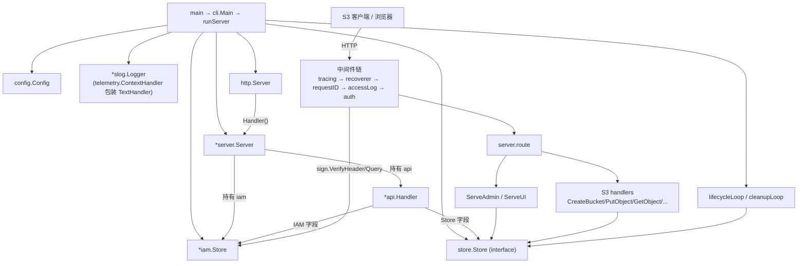
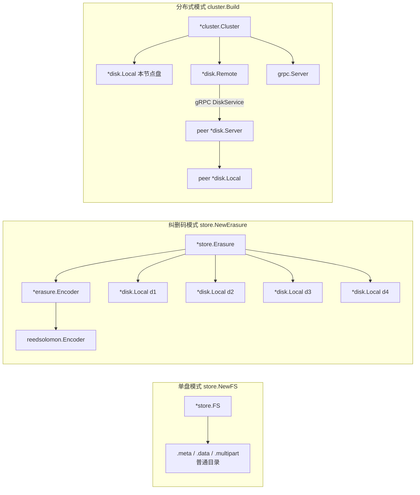
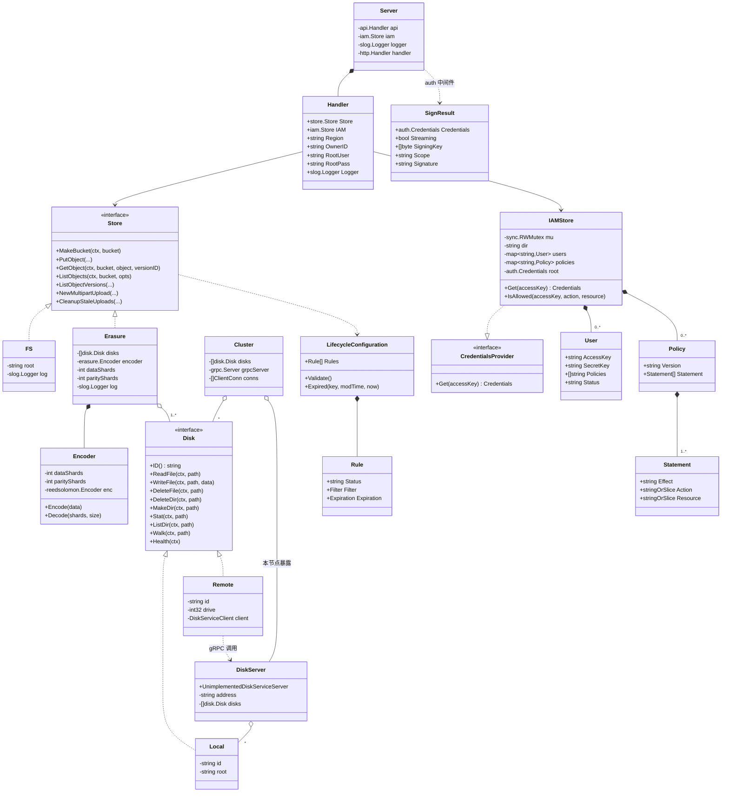

# gos3 运行时类架构图

本文档描述 gos3 运行时的对象装配、存储后端结构，以及核心类型/接口关系。

## 1. 进程内运行时装配与请求调用链

## 2. 三种存储后端的运行时对象

## 3. 核心类型 / 接口类图

关系图例：`<|..` 实现接口、`..|>` 实现接口、`*--` 组合、`o--` 聚合、`-->` 关联、`..>` 依赖。

## 要点

- `store.Store` 是唯一存储抽象，运行期只会实例化为 `*store.FS`（单盘）或 `*store.Erasure`（多盘/分布式）。
- `disk.Disk` 把「本地目录」和「远端节点盘」统一，`*store.Erasure` 完全不感知是本地还是 gRPC。
- `*iam.Store` 同时是 `sign.CredentialsProvider`，签名校验与鉴权共用同一份内存状态。
- `*api.Handler` 是 HTTP 处理器集合，`*server.Server` 只负责装配与路由/中间件。
